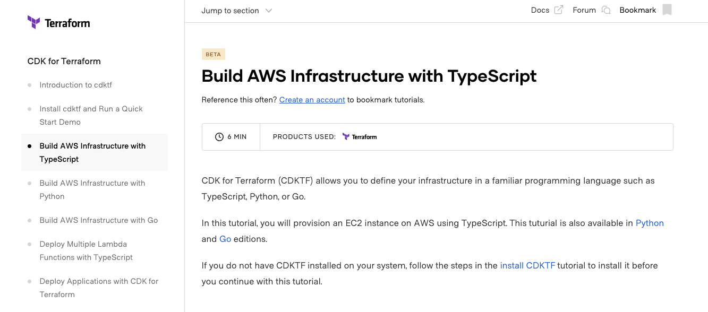

CDK for Terraform (Cloud Development Kit for Terraform (CDKTF)) とは TS や Python や Go などのプログラミング言語で IaC が行えるツールです。

FYI: <https://github.com/hashicorp/terraform-cdk>

つまり HCL を書かずに Terraform を使えるものです。
HCL を書いているときは「型が欲しい」「補完されたい」と思ったりもするものですが、TS で書くことでそれが解消できるという素晴らしいツールです。

さて、この CDKTF にはドキュメントがありますが、実は TS + GCP を実現する方法が書かれていません。

<https://www.terraform.io/cdktf>

そこでこの記事では TS + CDKTF で GCP に Hello World するところまでを書きます。

## init

まず cdktf を入れます。

```sh
npm install --global cdktf-cli@latest
```

そして cdk プロジェクトを作ります。

```
cdktf init
```

質問に答えるとプロジェクトができます。

## GCP にデプロイする

さて GCP にデプロイしましょう。

ここで作られたファイルを見ると

```ts
import { Construct } from "constructs";
import { App, TerraformStack } from "cdktf";

class MyStack extends TerraformStack {
  constructor(scope: Construct, name: string) {
    super(scope, name);
  }
}

const app = new App();
new MyStack(app, "cdktf");
app.synth();
```

とあり、GCP へのリソース指定はどこにもありません。

もしかして精製コマンドに何か必要だったのでしょうか。
オプションを見てみます。

```
cdktf init -h
cdktf init [OPTIONS]

Create a new cdktf project from a template.

Options:
      --version                   Show version number                  [boolean]
      --disable-logging           Dont write log files. Supported using the env
                                  CDKTF_DISABLE_LOGGING.
                                                       [boolean] [default: true]
      --disable-plugin-cache-env  Dont set TF_PLUGIN_CACHE_DIR automatically.
                                  This is useful when the plugin cache is
                                  configured differently. Supported using the
                                  env CDKTF_DISABLE_PLUGIN_CACHE_ENV.
                                                      [boolean] [default: false]
      --log-level                 Which log level should be written. Only
                                  supported via setting the env CDKTF_LOG_LEVEL
                                                                        [string]
      --template                  The template to be used to create a new
                                  project. Either URL to zip file or one of the
                                  built-in templates: ["csharp", "go", "java",
                                  "python", "python-pip", "typescript"] [string]
      --project-name              The name of the project.              [string]
      --project-description       The description of the project.       [string]
      --dist                      Install dependencies from a "dist" directory
                                  (for development)                     [string]
      --local                     Use local state storage for generated
                                  Terraform.          [boolean] [default: false]
      --cdktf-version             The cdktf version to use while creating a new
                                  project.           [string] [default: "0.9.0"]
      --from-terraform-project    Use a terraform project as the basis, CDK
                                  constructs will be generated based on the .tf
                                  files in the path                     [string]
  -h, --help                      Show help                            [boolean]
```

特に見つかるわけでもありません。

次にドキュメントを見てみましょう。



AWS についてしかありません。

AWS のドキュメントを見てみると

```ts
import { Construct } from "constructs";
import { App, TerraformStack, TerraformOutput } from "cdktf";
import { AwsProvider, ec2 } from "@cdktf/provider-aws";

class MyStack extends TerraformStack {
  constructor(scope: Construct, id: string) {
    super(scope, id);

    new AwsProvider(this, "aws", {
      region: "us-west-1",
    });

    const instance = new ec2.Instance(this, "compute", {
      ami: "ami-01456a894f71116f2",
      instanceType: "t2.micro",
    });

    new TerraformOutput(this, "public_ip", {
      value: instance.publicIp,
    });
  }
}

const app = new App();
new MyStack(app, "typescript-aws");
app.synth();
```

とあります。

<https://learn.hashicorp.com/tutorials/terraform/cdktf-build?in=terraform/cdktf>

つまり `import { AwsProvider, ec2 } from "@cdktf/provider-aws";` の GCP 版があればいけそうです。

そして cdktf 配下の npm レジストリを探すと、 `@cdktf/provider-google` が見つかります。

なので、`npm i @cdktf/provider-google` とすれば GCP リソースを持ってこれるようになります。

```ts
import { App, TerraformStack } from "cdktf";
import { Construct } from "constructs";
import * as fs from "fs";
import * as path from "path";

import {
  AppEngineApplication,
  CloudbuildTrigger,
  CloudRunService,
  CloudRunServiceIamPolicy,
  ContainerRegistry,
  DataGoogleIamPolicy,
  GoogleProvider,
} from "@cdktf/provider-google";

class MyStack extends TerraformStack {
  constructor(scope: Construct, name: string) {
    super(scope, name);
    const credentialsPath = path.join(process.cwd(), "google.json");
    const credentials = fs.existsSync(credentialsPath)
      ? fs.readFileSync(credentialsPath).toString()
      : "{}";
    const projectId = "xxx";

    new GoogleProvider(this, "Google", {
      region: "asia-northeast1",
      zone: "asia-northeast1-a",
      project: projectId,
      credentials,
    });

    new AppEngineApplication(this, "gae", {
      project: projectId,
      locationId: "asia-northeast1",
      databaseType: "CLOUD_FIRESTORE",
    });
  }
}

const app = new App();
new MyStack(app, "iac");
app.synth();
```

あとは apply すればリソースができます。

## ./.gen/providers/google というやり方がある

一方で、公式の example レポジトリを調べていると `./.gen/providers/google` というパスからリソースを持ってくる例を見つかります。

- <https://github.com/hashicorp/terraform-cdk/blob/main/examples/typescript/google/main.ts>
- <https://github.com/hashicorp/terraform-cdk/blob/main/examples/typescript/google-cloudrun/main.ts>
- <https://awsbloglink.wordpress.com/2021/01/21/cdk-for-terraform-gcp/>

しかし生成したファイルには `./.gen/providers/google` なんてものはありません。どこから作るのでしょうか。

実はこれは `npm run get` つまり `cdktf get` する必要があります。
というわけで実行すると

```
> cdktf@1.0.0 get
> cdktf get

ERROR: Please specify providers or modules in "cdktf.json" config file
```

と言われます。

どうやら cdktf.json に設定がいるようです。

その設定とはこうです。

```json
{
  ...
  "terraformProviders": ["google@~> 4.7.0"],
  ...
}
```

この状態でコマンドを叩くと

```sh
❯ npm run get

> cdktf@1.0.0 get
> cdktf get

Generated typescript constructs in the output directory: .gen
```

と成功し、.gen が生成されます。

あとはここから Terraform CDK のクラスを import できます。

インフラの構成が終わったら `cdktf deploy` でデプロイできます。
このとき cdk.json の設定によって自動でコンパイルされるのですが、コンパイル済みは ckd.out に出力されておりそのコードをみると Terraform のコードが出力されているので、それが apply されて構成が完了します。
