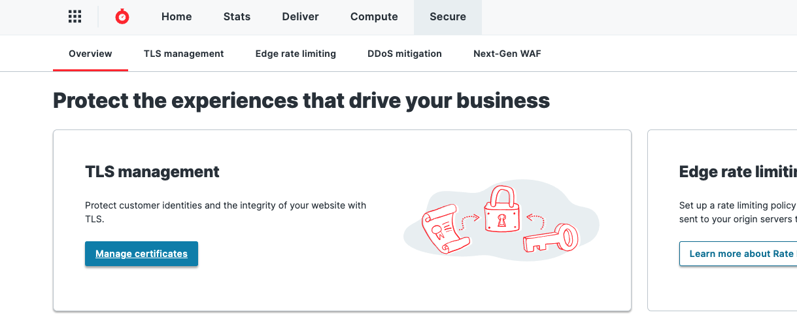

分かってしまえば簡単な話ではあるがいろいろ回り道をしたのでメモ。
この辺の設定は偉大なる先輩方や同僚方にすでにしてもらっていることもあってよく分かっていない。
事実、[Gatsby の DSG を Fastly で実現する](https://blog.ojisan.io/gatsby-dsg-fastly/) を書いたときは分かっていなかったので設定できていなかったりもする。

## ドメインの追加をする

Fastly の設定画面にドメインを追加する導線がある。
なのでまずはここにドメインを登録すればいい。

ただ自分の持っているドメインと紐づけるのであれば、そのドメインに対して CNAME を設定する必要がある。
その値は何であろうか。

[Adding CNAME records](https://docs.fastly.com/en/guides/adding-cname-records) を確認してみよう。
"Non-TLS hostnames and limiting traffic" の節を読むと、HTTP しかサポートしない場合であれば `nonssl.global.fastly.net.` を使えば良さそうだ。
しかし現実には HTTPS を使いたいはずであるのでこの設定は使えない。
つまり TLS サポートされた設定が必要となる。

## TLS-enabled hostnames

そのドキュメントの直後に TLS-enabled hostnames というセクションがあり、

> If you've purchased Fastly TLS, use one of the following HTTP/1.1 and HTTP/2 enabled hostnames:
>
> - Use `[letter].sni.global.fastly.net` to route traffic through Fastly's entire global network.
> - Use `j.sni.global.fastly.net` for TLS 1.3 and TLS 1.2 and `k.sni.global.fastly.net` for TLS 1.3 + 0RTT and TLS 1.2 support

とある。つまり、Fastly TLS を購入し、もし TLS1.3 サポートを購入すれば `j.sni.global.fastly.net` を指定すれば良いのである。

ここで課金が必要となるのである。今は有料プランを使っているので当時の状況を思い出せないが、確かクレカ登録しないと ON にできないとかになっていたような気がする。
とはいえ Fastly はクレカ登録しなくても無料枠でも使え、救済手段が無いわけでもない。

## Fastly TLS

[Fastly TLS](https://docs.fastly.com/products/tls-service-options#fastly-tls) の節を読んでいくと、"Free TLS via the shared Fastly domain" という節にその救済手段が書かれている。

> Fastly offers a free TLS option that allows you to serve HTTPS traffic using an address like example.global.ssl.fastly.net via a shared Fastly domain.

とある通り、`example.global.ssl.fastly.net` を通せばよい。example は example なのでここは自分の好きな値に書き換えれる。`ojisan.global.ssl.fastly.net` のように使える。

ただ、もちろん無制限というわけではなく、

> You cannot DNS alias your own domain to the shared domain. If you do, a TLS name mismatch warning will appear in the browser.
> When using free TLS, all traffic is routed through Fastly's entire global network.

とある通り、独自のドメインは使えなくなる。あくまでも `definitely-charmed-turkey.edgecompute.app` のような Fastly が自動生成した URL と異なった URL を自分の好きなフレーズを入れて作りたい機能と思えば良いだろう。

じゃあカスタムドメインを使いたければどうすればいいのかと言う話であるが、「クレカ登録して Fastly TLS を使え」ということである。

## 証明書周りの設定

secure タブの "manage certificates" から設定できる。

ここでどのドメインにどの証明書を割り当てるかを選べる。
証明書は Let's Encrypt を使えるのでそれを選択しておけば良いだろう。
もちろんすでに自分で購入済であればそれを upload して使うこともできる。
このときに TLS のバージョンを選べる。
そのバージョンによって先の章で見た

> Use `j.sni.global.fastly.net` for TLS 1.3 and TLS 1.2 and `k.sni.global.fastly.net` for TLS 1.3 + 0RTT and TLS 1.2 support

が変わるのでどのバージョンを使ったかは覚えておこう。

証明書の設定が終わればそのドメインと証明書を紐づけるために DNS 側での設定が必要となる。
Fastly がそれ用の CNAME を用意してくれ、それが表示されているはずなので、それをコピペして DNS の CNAME の設定をすれば良い。
(いわゆる ACME DNS challenge)

## 疎通

これで準備は全て整った。
ただ証明書周りを設定する前にすでに Fastly に自ドメインを登録している場合は、一度設定を消してもう一度やり直した方が良いかもしれない。
そうしないと筆者は繋がらなかった。
ともあれ、設定は全部終わったので Fastly に設定済みの自ドメインにアクセスするときちんと表示されるはずである。わーい。
