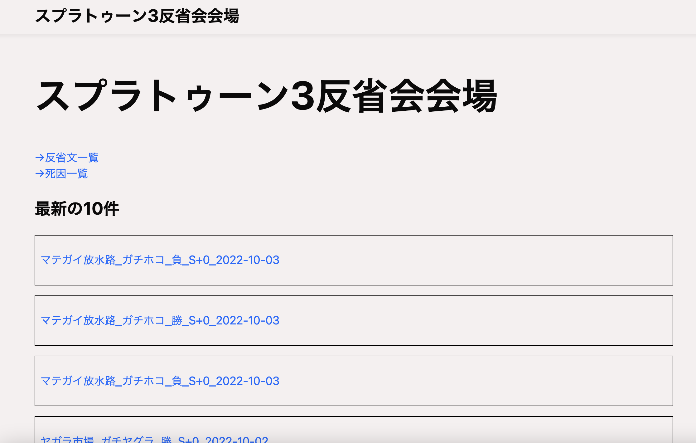
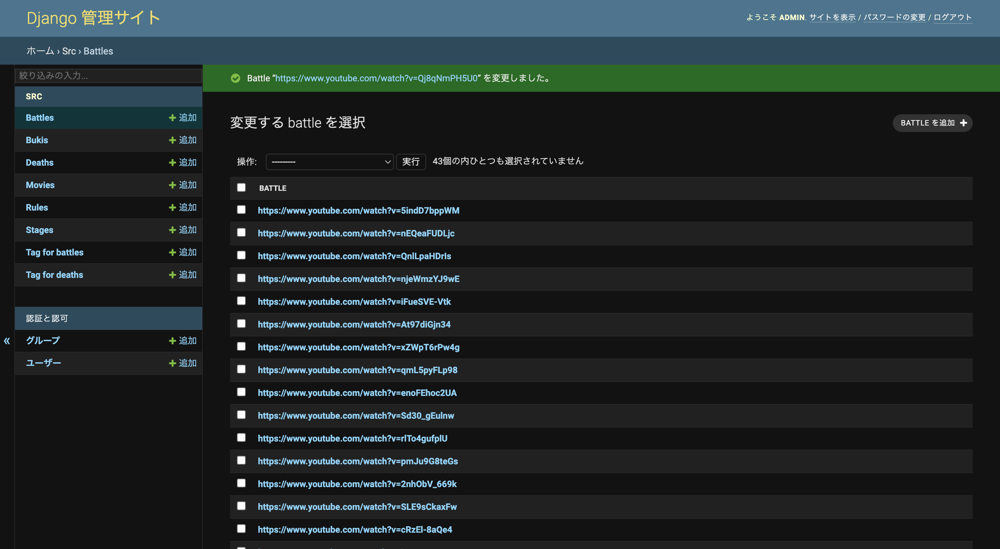
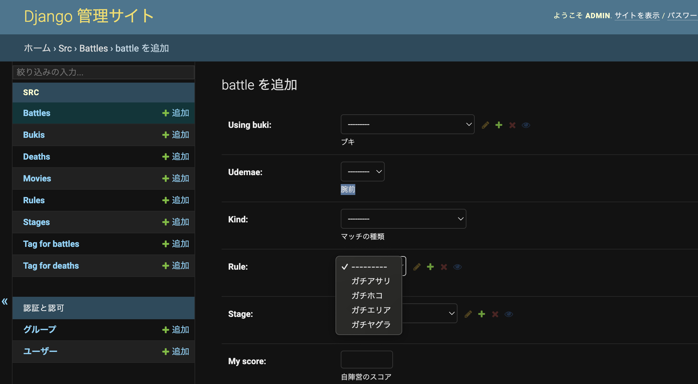
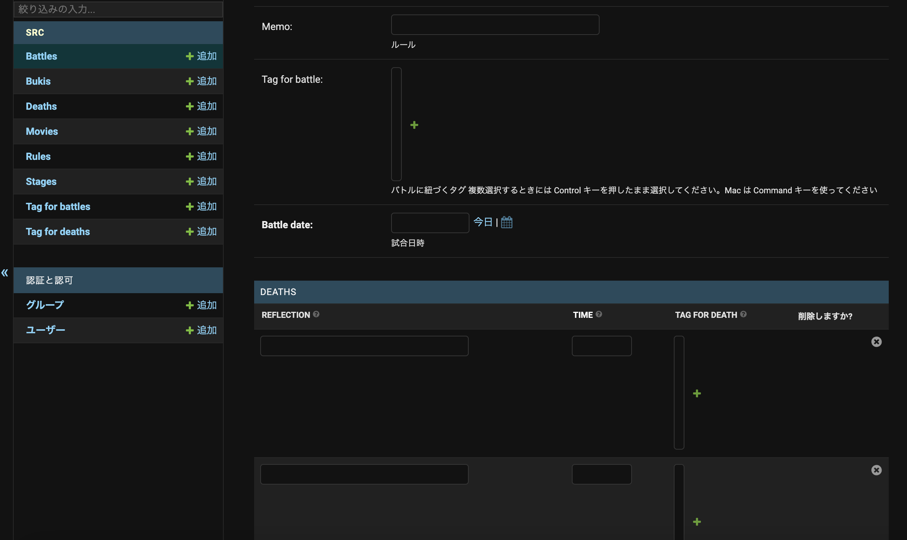
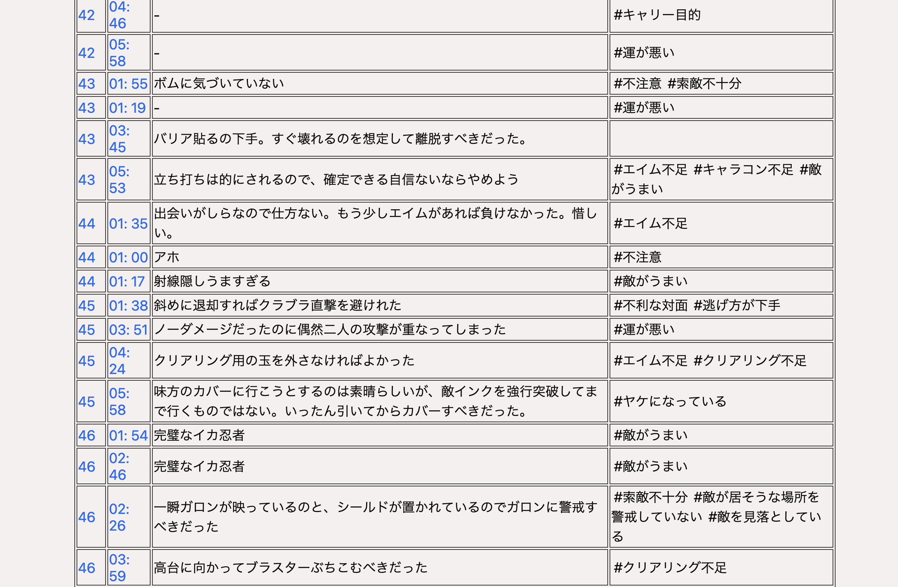
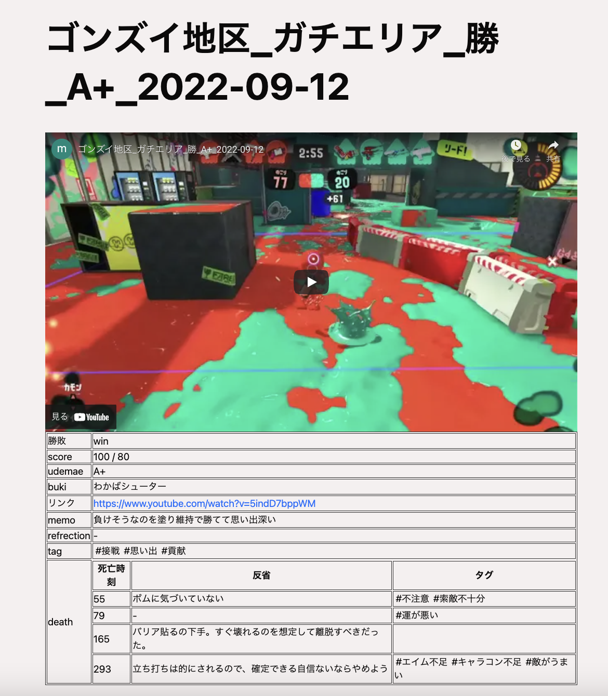

仕事の都合上、Django を覚える必要が出たので、その素振り課題が欲しい + スプラトゥーンを強くなりたいというニーズが出会って [スプラトゥーン 3 反省会会場](https://splatoon3-hansei.ojisan.dev/) を作りました。



色々技術的な挑戦をしたのでそのまとめをします。

## スプラトゥーン 3 反省会会場とは

スプラトゥーン 3 反省会会場は、自分のスプラトゥーン３プレイ動画を録画して、後から見返して反省をするためのサイトです。ただ反省文を書くためだけに作っていたのですが、どうせなら改善点のアドバイスなどがもらえるようにと思って Youtube への紐付けと反省文を外部から見られるようにしています。

反省文を書こうと思ったきっかけはウデマエを上げたいからで、普段同じようなミスをしている気がしているのでしっかりと反省することと、その反省すべきシーンだけを後から何度でも検索して見返せるようにすることが目的です。

いまではご飯を食べる時は常に自分の動画を見ながら食べるようにしています。

## Django 、結構良い

今回 Django を使ったのは、仕事で使うからというのが一番大きな理由です。ただ、私のブログの他のエントリから察せられるように Python は明らかに僕の嗜好には合わない言語です。それでも使ってみると色々良さが滲みてきました。

### 型(のようなもの)がつく

Django はモデルベースの FW で、いわゆる Entity の利用が推奨されます。
フィールドはそれぞれ models.CharField のような関数を呼び出して定義するのですが、これが型のように効いてくれます。
DB の migration に使われるだけでなく、この情報を Serializer に渡せばそこから Swagger の生成までできます。

### 正しい API Spec を生成できる

そしてモデルはバリデーションを標準でできるので、思いがけないところからバリデータとレスポンスとドキュメントが整合する仕組みが手に入ります。
僕は Python などの言語や Django のような FW は、こういった実値と API Spec を一致させられないという思い出があり嫌いだったのですが、普通に良い感じの Spec を生成できてとても良いと思いました。

### Admin のおかげで入稿をサボれる

今回僕は入稿作業が必要となるのですが、Django には Admin 機能があり、DB のテーブルに対する GUI が提供されます。そしてそれはモデルベースのバリデーションがされるので正しい値を入れることができます。この Admin を使うことで入稿システムそのものを作ることができました。読み取り系の API だけ作れば良いので大幅に工数を削減できます。



しかも admin はデータモデルを解釈してくれるので、親から子のデータを作れたり、入力時にデータモデル構文のロジックでバリデーションできたり、使い勝手も良いです。





### その気になれば剥がせる

migration は model が行うので、この model だけをメンテナンスして実際に DB にアクセスするアプリケーションは別言語で書くこともできます。そのため最悪剥がせると思って Django を選択しています。特に現代は Rust の sqlx のように SQL とスキーマとマッピング先の DTO の型が合うかをコンパイル時に検証できる仕組みがあるので、DB さえしっかり守っておけばいくらでも後から実装を差し替えられると思っています。昔は Django や Rais のようなものを入れると一連托生といった感じでしたが、今はむしろ（剥がすことを最初に考えていれば）剥がしやすい FW だと認識しています。そのとき Django のデータモデル構文は（DB に馴染みのない私にとっては） SQL を書かずとも DB のテーブルを表現しやすく、DB のスキーマ定義はかなりしやすいです。

## データベース

### 目標はタダ

Django のモデルを使う以上は DB は RDB を使う必要があります。（多分）
そのとき、RDB のコストが気になりました。
普通にマネージドサービスを契約すると月 5000 円はかかると思っています。
どうにかしてこれを無料にしたいです。

### planetscale を試した

そこで僕はまず [PlanetScale](https://planetscale.com/) を試しました。これは RDB の PaaS なのですが、無料枠があるのが特徴的です。無料で使える RDB として認知されていると思います。今回はこれを使うはずでした。

しかし、問題が発生しました。なんと [外部キー制約を使えません](https://github.com/planetscale/discussion/discussions/18) 。自分で勝手に table_id のようなカラムを生やせば外部キーを作れますが、Django の ForeignKey を使ってる以上は外部キー制約も入ってしまいます。なので 背に腹は変えられないので Cloud SQL を使います。

### Cloud SQL をセットアップ

これはこれで詰まるところがありました。[Django 製アプリを Cloud Run で動かすまで](https://blog.ojisan.io/django-cloud-run/) にも書きましたが、DB に IP 制限をかけると CI/CD パイプライン で実行する migration script が動かなくなります。なぜならどの IP が使われるかわからないからです。もちろんワークフローの中で IP 取得して gcloud コマンドでその IP で穴を開けるような設定をすれば実現できますが、流石にめんどくさいので諦めました。なのでとても複雑なパスワードにしてインターネットに公開しています。

### 節約する

これで Cloud SQL が動くようになりましたが、ここからコスト減のために節約していきます。

#### ローカルと開発系のセットアップ

まずローカルでは sqlite を使うようにしました。これを実現するために DB 周りの設定は全部環境変数にまとめています。

```py
DATABASES = {
    'default': {
        'ENGINE': env('ENGINE'),
        'NAME': env('DB_NAME'),
        'USER': env('DB_USER'),
        'PASSWORD': env('DB_PASSWORD'),
        'HOST': env('DB_HOST'),
        'PORT': env('DB_PORT'),
  },
}
```

開発系では一番やすい地域の共用 CPU, ストレージ 10GB で運用しています。アクセスに時間はかかりますが、開発系で実データ入稿をするわけではないので許容です。

#### 本番の DB をなるべく使わないようにする

本番では DB を Tokyo リージョンに設置し、メモリとストレージも少しだけ積んでいます。ただコストはかけたくないので入稿する時以外は停止させています。この停止時間を実現するためにアプリケーションは Jamstack で構成します。つまり入稿時とビルド時しか ON にしません。そうすることで圧倒的にコストを下げることができます。

## Astro で Jamstack

Jamstack にするには静的生成できるツールが必要です。ここは興味本位で Astro を選択しました。これがかなり良かったです。

### path 生成と props 生成を同時に行える

Next などだと動的パスのリストを手に入れて、そのパスごとに props を作っていました。
つまりパスの数だけデータ取得する必要があります。
しかし Astro では path と props を両方同時に設定できます。
詳しくは [Next.js にあるアレ、Astro でどうするか](https://blog.ojisan.io/next-astro/) に書きました。

## 入稿の方法

[キャプチャーボードを買ってスプラトゥーンの反省をしている話](https://blog.ojisan.io/bought-capture-board/) にあるようにまずキャプチャーボードで撮影しています。その後に Youtube にアップロードしてそのリンクを入稿しています。

Youtube を使っている理由はコスト減です。例えばキャプチャーボードで 1920 x 1080 サイズで録画した場合 5 分の試合で 1GB ほどのサイズになるのですが、これは S3 などだと月 0.023USD/GB です。つまり試合一つにつき毎月 3 円ほどかかります。そしてこれが 100 試合になると毎月 300 円かかります。静的データの保持だけでずっとハーゲンダッツ買えるお金がかかることになるのが嫌だったので、Youtube を利用しています。

しかし Youtube では 10GB ほどあげると 24 時間アップロードできなくなってしまうので、動画は圧縮しています。Windows11 で録画しているのでムービーエディタで 540 x 320 まで小さくしてから Youtube にアップロードしています。これは Youtube をやめて GCS にアップロード、functions トリガーで ffmpeg 噛ませて圧縮して保存するといったことをしようとしていますが、なかなかうまく行ってないです。なのでしばらく Youtube を使います。Youtube だと iframe でプレイヤー自体を埋め込めるのもかなり強いです。昔 shaka player を使って高機能なプレイヤーを実装しようとしましたが断念した過去があります。

また撮影のトリミングも悩みどころです。試合と動画を紐づけたいので、試合時間だけにトリミングしたいのですがこの作業は意外に時間がかかります。Windows 純正の作業アプリでは待ち時間も生まれます。これは撮影可否をハードウェアで制御できるようなキャプチャーボードを買うか、非同期にトリミングできるソフトを買うか、非同期処理でトリミングできるようなアプリを自作するかで考えています。割と自作にいま心が揺れていて、トリミングの結果をコピーするのであれば並列化させても問題なく実現できると思っています。ただ時間がない・・・

## スプラトゥーン反省サイトのいいところ

この反省文サイトの良さを上げるとしたら、死因を書けて一覧で見れることです。



いつもご飯食べてる時や、スプラトゥーンする前に見返して気合を入れています。

またブキ、ステージ、勝敗なども保存しているのでいつか自分の癖などを数値的に分析したいなと思っています。



## おわりに

反省文を書いていま S+2 まできました。 S+10 までいくと X になれる噂を聞いたのでもっと頑張ります。

あと一番の反省はスプラトゥーン３を買ったことです。
