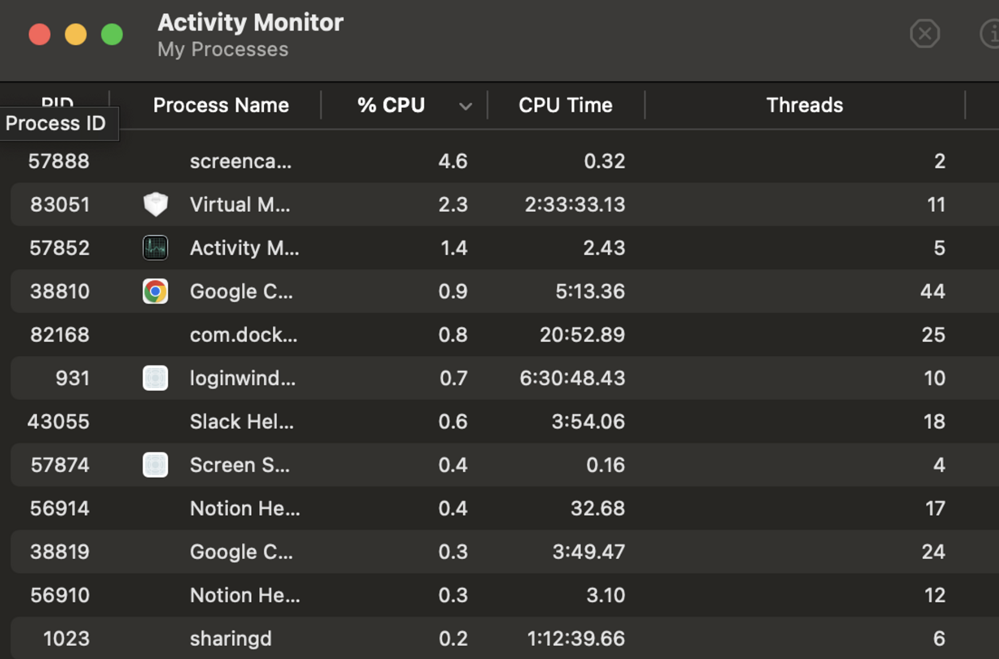
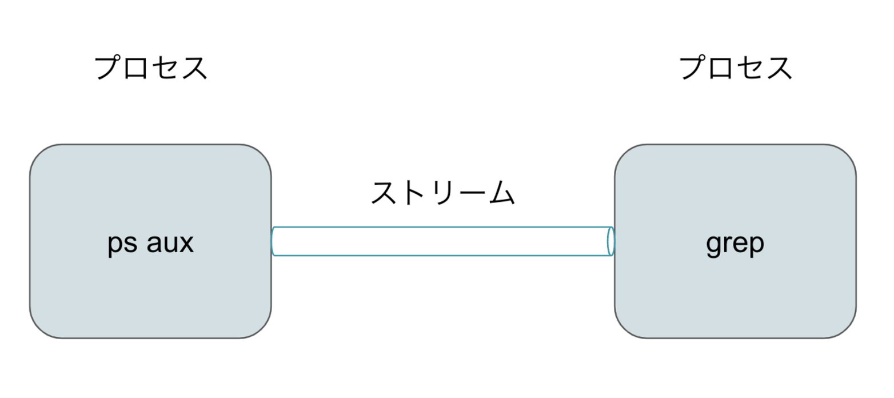
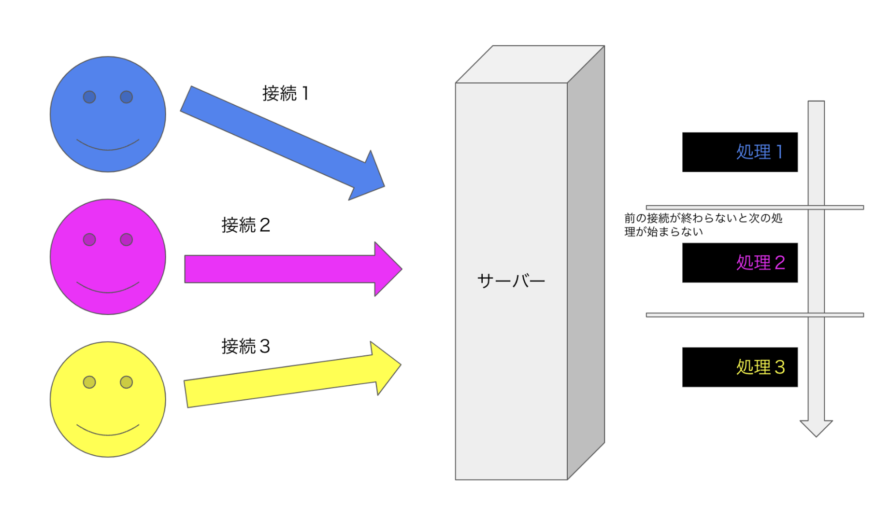
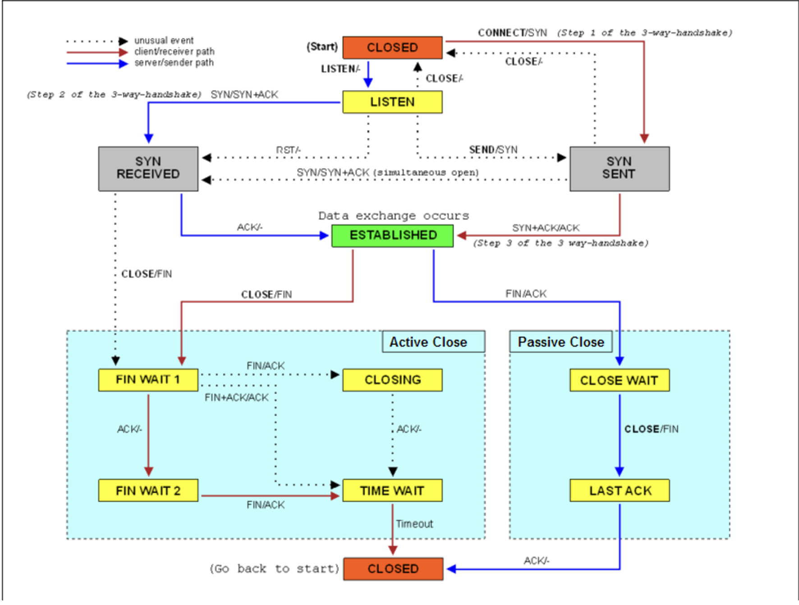
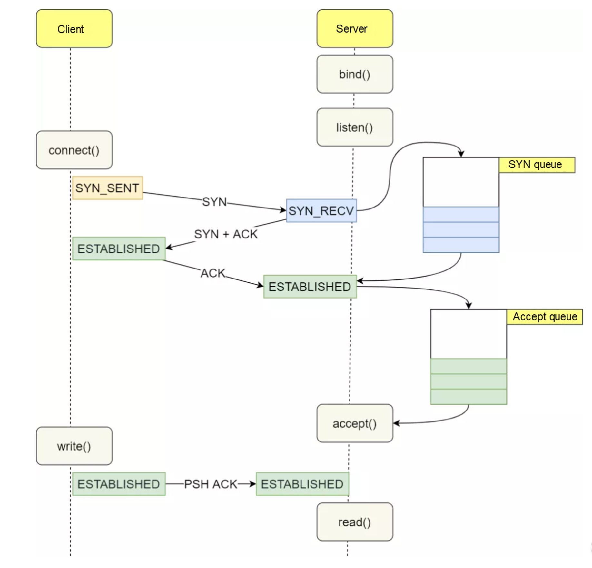
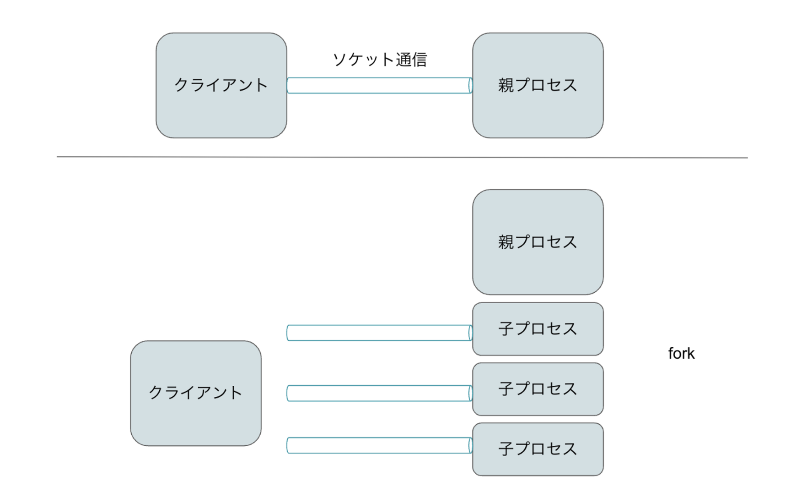
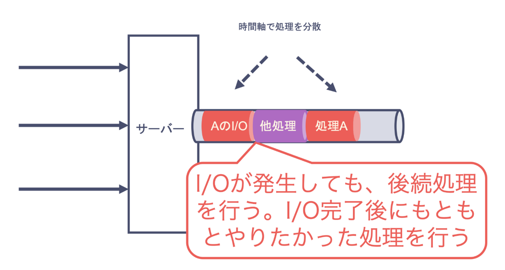
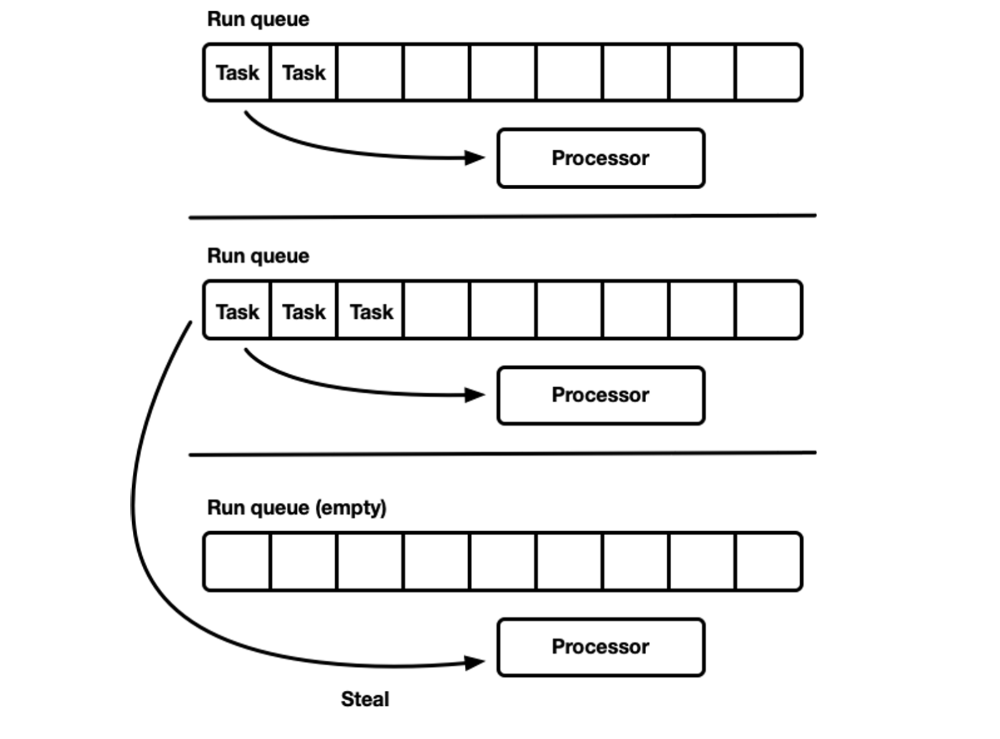
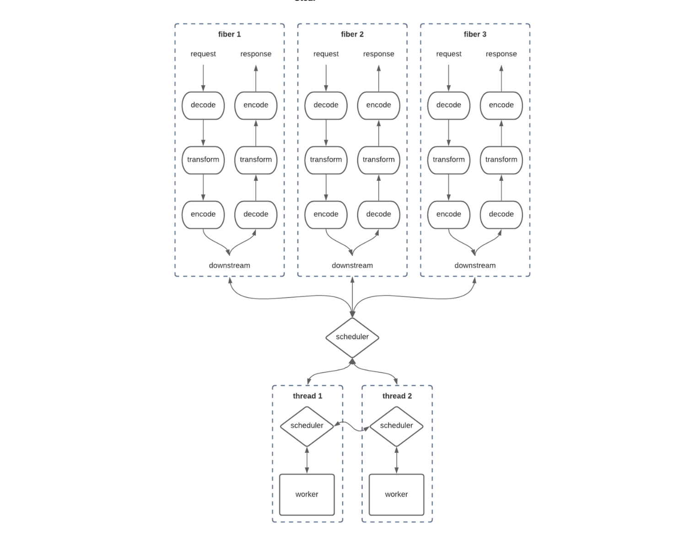

## はじめに

最近プログラマーとしてのキャリアに一区切りつけようと思っており、これまでのプログラミングの勉強の集大成となるブログを書きたくなったので書く。初めてプログラミングをして、フロントエンド開発をして、サーバーから値が返ってきたときは「どういう仕組みで値が返ってきたんだ？」と疑問に思っていた。ずっと理解したくて理解できていなかった。だからずっと勉強していた。そして最近になってようやく自分の言葉で説明できるようになった気がしたのでブログを書きたい。

### 2015 年版が自分の原点であり、この記事を書くモチベーションになった

このような記事は実は過去に存在している。

FYI: <https://blog.yuuk.io/entry/2015-webserver-architecture>


その記事はサーバーがどういう仕組みで動いていて、どのように進化し、2015 年に至るかを解説してくれた記事だ。自分がプログラミングを始めた頃に同僚から勧められて読んだ気がする。当時自分は Node.js を書いていたのでその記事の中では後半以降の部類の話しか理解できなかった。自分の知らないことだらけで「いつか理解したいなぁ」と思った記憶がある。いや、Node.js の話も理解していたのか怪しい。当時は「動けばそれで OK」といった感じであまり技術の仕組みとか勉強していなかったと思う。でもいつか理解したいという気持ちはずっと持っていたし、現にその気持ちを今日まで持って勉強を続けていた。このブログでもやたら並行プログラミングや非同期処理について書いているのはまさしくそういう原体験があるからだ。そんな中、最近初心に戻って[そのブログ](https://blog.yuuk.io/entry/2015-webserver-architecture)をあらためて読み返して見ると、今だと記事に書いてあることを理解できたりその記事の未来版・続きを書けることに気づいた。なので書いてみようと思う。

### 注意

筆者がプログラミングを始めたのは 2018 年であり、サーバーサイド開発の経験は Node.js, tokio, cats-effect くらいしかない(一瞬 Java も書いていたがコピペしてただけなのでそれはノーカン、Python も書いたがほぼ JSON Schema を書いていたのでノーカン)。そもそもハローワールドが IO 多重化 から始まっており、その次の経験が M:N で動く Work-Steal 可能なグリーンスレッドといったようにイマドキなものしか経験がなく、ポエミーな話や歴史的な話はできない。そもそもフロントエンド専業で大学で教育を受けたわけでもないので、Web サーバーやコンピュータの事情はよく知らないしシステムプログラミングもしたことがないのでサーバーに関する専門的な話はできない。Node.js の章に入ると急に饒舌になると思うが、それ以前の章はあくまで教科書的な話しかできないだろう。なので経験に基づいた話を知りたければ先人の版を読んでほしい。

また専門家が書いたわけでもなくただの職業プログラマが自分の勉強のまとめとして書いたものなので間違いや不適切な表現もあるかもしれない。もし見つけたら [sadnessOjisan](https://twitter.com/sadnessOjisan) に連絡をくれると嬉しい。直接 [Issue](https://github.com/sadnessOjisan/blog.ojisan.io/issues) や修正 PR を出してくれるともっと嬉しい。一応プロの専門家の方にレビューをして頂いたが、分量が分量だな上いきなり投げつけた感じなので漏れもあるだろう。それはそんなレビュー依頼をした私の責任でありレビュアーの責任ではないことを先に断ります。レビューしてくださった [@mitama_rs](https://twitter.com/mitama_rs) さん、ありがとうございます。美味しいご飯食べにいきましょう。

### 参考文献

全体的に

- [ふつうの Linux プログラミング 第 2 版](https://www.sbcr.jp/product/4797386479/)
- [並行プログラミング入門 Rust、C、アセンブリによる実装からのアプローチ](https://www.oreilly.co.jp/books/9784873119595/)

で勉強していた。僕のようにコンピュータサイエンスの素養を持たないものが後追いで勉強するには本当に良い本でオススメだ。

その他参考にした資料は文中でその都度明示した。

### FW や言語の優劣を語らないために世代という表現をする

さて古いアーキテクチャの話から始めるが、古い = 劣っている というわけではないことを最初に強調したい。その古いものを取って代わった新しいものが次々と出てきているが、その古い側も新しい側のアイデアを輸入して進化を続けている。そのためその時点でのスナップショットとして「当時の思想が古い」と表現するが、現代においてもそのライブラリが古い・劣っているということは必ずしも意味しない。そこで「当時から時間が経ってしまって古い」という意味合いで「世代」という言葉をこのブログでは使う。

## 入門 システムプログラミング

システムプログラミングから復習しよう。反復サーバーとソケット通信の話から始まるのだが、そもそもプロセス間通信やファイルディスクリプタは IO 多重化の話などでも出てくるのでまずはシステムプログラミングの復習から始めよう。

### プロセスとスレッド

まずコンピュータの中にはプロセスとスレッドというものがある。自分は「プロセスは実行したプログラムやアプリケーションそのものを指していて、スレッドはその中で動く処理の単位でしょ」のように捉えているが、「もっと解像度高く説明して」と言われたり「定義は？」と言われると正直答えられない。なのでマイクロソフトの説明をそのまま貼り付ける。

> 各  *プロセス*  は、プログラムの実行に必要なリソースを提供します。 プロセスには、仮想アドレス空間、実行可能コード、システム オブジェクトへのオープン ハンドル、セキュリティ コンテキスト、一意のプロセス識別子、環境変数、優先度クラス、最小および最大ワーキング セットサイズ、および少なくとも 1 つの実行スレッドがあります。 各プロセスは、プライマリ スレッドと呼ばれる 1 つの  *スレッド*で開始されますが、任意のスレッドから追加のスレッドを作成できます。
>
> *スレッド*とは、実行をスケジュールできるプロセス内のエンティティです。 プロセスのすべてのスレッドは、その仮想アドレス空間とシステム リソースを共有します。 さらに、各スレッドは、例外ハンドラー、スケジューリング優先度、スレッド ローカル ストレージ、一意のスレッド識別子、およびシステムがスケジュールされるまでスレッド コンテキストを保存するために使用する一連の構造体を保持します。 *スレッド コンテキスト*には、スレッドのマシン レジスタのセット、カーネル スタック、スレッド環境ブロック、およびスレッドのプロセスのアドレス空間内のユーザー スタックが含まれます。 スレッドは、独自のセキュリティ コンテキストを持つこともできます。これは、クライアントの偽装に使用できます。

[プロセスとスレッドの概要 - Win32 apps](https://learn.microsoft.com/ja-jp/windows/win32/procthread/about-processes-and-threads)

よくわからないかもしれないので具体例を出すと、Mac の Activity Monitor に現れる。



スレッドとプロセスの違いは、スレッドがプロセスに内包されているだけかのようにも見えるかもしれないが、コンピュータの視点から見るとメモリ領域を共有しているかという大きな違いがある。プロセスは異なるプロセス間ではメモリ領域が分かれて各プロセスが持つデータにアクセスできない一方で、スレッドは同一プロセスの中であれば別スレッドとデータを共有できる。スレッドはデータを共有できるので効率的な面もあるが、データ競合という厄介な面もあるのでそれはのちに紹介する。またプロセスもスレッドと比較してコストはかかるものの後述するファイルディスクリプタを使うことでデータの共有はできる。

プロセスは作られるたびに固有の id が割り振られ、区別可能なものとなる。これはプロセス間通信などに使われ、身近の例だとプロセスのキルにも使われる。

```
> ps aux | grep alacritty
ojisan          58109   1.6  0.2 409966368  55088   ??  S    12:53PM   0:00.24 /Applications/Alacritty.app/Contents/MacOS/alacritty

> kill 58109
```

プロセス間通信はサーバーを理解する上でとても重要な概念になるので見ていこう。なぜならサーバー間通信の正体はプロセス間通信だからだ。その理解のためにプロセス間通信の簡単な例から見ていく。

プロセス間通信の一番身近な例はパイプだろう。プログラムの入出力の結果を別のプログラムの入力に渡せる。先の例だと、`ps` プロセスの出力結果を `grep` プロセスに渡している。


ではプログラム、それが実行されて動くプロセスはどのようにして他プロセスにアクセスするのだろうか。

### ファイルディスクリプター

まずプロセスにプログラムがアクセスするためにはファイルディスクリプターというものを使う。日本語だとファイル記述子とも言われる。

自分の説明に自信がないので Wikipedia の説明を貼り付けておく。

> In Unix and Unix-like computer operating systems, a file descriptor (FD, less frequently fildes) is a process-unique identifier (handle) for a file or other input/output resource, such as a pipe or network socket.

FYI: <https://en.wikipedia.org/wiki/File_descriptor>

プログラムはファイルディスクリプタを指定してプロセスやファイルにアクセスし、そこに read / write をすることで値を取り出したり送り出せる。イメージとしてはプロセス間にストリームというバイト列を流す配管があり、ここのデータを流し込んで読み書きするイメージだ。

（※ストリームという概念は [ふつうの Linux プログラミング 第 2 版](<[https://www.sbcr.jp/product/4797386479/](https://www.sbcr.jp/product/4797386479/)>) で登場する概念であり、この説明に関しては <https://jibun.atmarkit.co.jp/lskill01/rensai/fulinux/04/01.html> でも読める。)



プロセスはファイルディスクリプタを持ち、(POSIX 上は)0-2 を標準で持っている。0 は標準入力、1 は標準出力、2 は標準エラーだ。それ以上の数字は汎用のファイルディスクリプタで必要に応じて作る。

そしてプロセス間通信(IPC)は、このファイルディスクリプタを指定して別プロセス間でデータをやりとりすることで実現できる。具体的にはファイル、シグナル、ソケット、パイプなどが当てはまる。

- <https://ja.wikipedia.org/wiki/プロセス間通信>
- <https://learn.microsoft.com/ja-jp/windows/win32/ipc/interprocess-communications>

では、そのファイルディスクリプタはどのようにして作るのだろうか。その一つに open がある。

```
> man 2 open

OPEN(2)                               System Calls Manual                               OPEN(2)

NAME
     open, openat – open or create a file for reading or writing

SYNOPSIS
     #include <fcntl.h>

     int
     open(const char *path, int oflag, ...);

     int
     openat(int fd, const char *path, int oflag, ...);

DESCRIPTION
     The file name specified by path is opened for reading and/or writing, as specified by the
     argument oflag; the file descriptor is returned to the calling process.
```

open は与えられたファイルパスにあるファイルへのファイルディスクリプタを返す。先ほどプロセス間通信の例にファイルを上げたが、それは例えば Unix ではファイルシステム上では全てがファイルとして扱われるためである。例えばキーボードのようなハードウェアもマウントしてしまえば Unix 上ではファイルとして扱え、キーボードの入力もストリームを流れるバイト列として扱えるようになる。

FYI: <https://www.ritsumei.ac.jp/~mmr14135/johoWeb/unix02.html>

またファイルディスクリプタを作れるシステムコールには open 以外にも

- creat()
- socket()
- accept()
- socketpair()
- pipe()
- epoll_create() (Linux)
- signalfd() (Linux)
- eventfd() (Linux)
- timerfd_create() (Linux)
- memfd_create() (Linux)
- userfaultfd() (Linux)
- fanotify_init() (Linux)
- inotify_init() (Linux)
- clone() (with flag CLONE_PIDFD, Linux)
- pidfd_open() (Linux)
- open_by_handle_at() (Linux)

がある。

FYI: [https://en.wikipedia.org/wiki/File_descriptor](https://en.wikipedia.org/wiki/File_descriptor)

### ストリームへの読み書き

ファイルディスクリプターが分かれば、その口からバイト列を流したり取得できる。それが read と wite だ。

```
> man 2 read

READ(2)                               System Calls Manual                               READ(2)

NAME
     pread, read, preadv, readv – read input

LIBRARY
     Standard C Library (libc, -lc)

SYNOPSIS
     #include <sys/types.h>
     #include <sys/uio.h>
     #include <unistd.h>

     ssize_t
     pread(int d, void *buf, size_t nbyte, off_t offset);

     ssize_t
     read(int fildes, void *buf, size_t nbyte);

     ssize_t
     preadv(int d, const struct iovec *iov, int iovcnt, off_t offset);

     ssize_t
     readv(int d, const struct iovec *iov, int iovcnt);

DESCRIPTION
     read() attempts to read nbyte bytes of data from the object referenced by the descriptor
     fildes into the buffer pointed to by buf.  readv() performs the same action, but scatters
     the input data into the iovcnt buffers specified by the members of the iov array: iov[0],
     iov[1], ..., iov[iovcnt-1].  pread() and preadv() perform the same functions, but read
     from the specified position in the file without modifying the file pointer.
```

read(2) では `ssize_t read(int fildes, void *buf, size_t nbyte);` で指定したファイルディスクリプタから指定した bufsize 分だけ buf へとバイト列を読み込ませる。void なのに buf を受け入れられることが不思議に思うかもしれないが、これは void 型ポインタというもので TypeScript でいう any 型みたいなものだ。

FYI: http://wisdom.sakura.ne.jp/programming/c/c47.html

```
> man 2 write

WRITE(2)                              System Calls Manual                              WRITE(2)

NAME
     pwrite, write, pwritev, writev – write output

LIBRARY
     Standard C Library (libc, -lc)

SYNOPSIS
     #include <unistd.h>

     ssize_t
     pwrite(int fildes, const void *buf, size_t nbyte, off_t offset);

     ssize_t
     write(int fildes, const void *buf, size_t nbyte);

     #include <sys/uio.h>

     ssize_t
     writev(int fildes, const struct iovec *iov, int iovcnt);

     ssize_t
     pwritev(int fildes, const struct iovec *iov, int iovcnt, off_t offset);

DESCRIPTION
     write() attempts to write nbyte of data to the object referenced by the descriptor fildes
     from the buffer pointed to by buf.  writev() performs the same action, but gathers the
     output data from the iovcnt buffers specified by the members of the iov array: iov[0],
     iov[1], ..., iov[iovcnt-1].  pwrite() and pwritev() perform the same functions, but write
     to the specified position in the file without modifying the file pointer.
```

反対に write は buf を渡すことで nbyte 分だけ指定したファイルディスクリプタへとバイト列を流し込める。ここでファイルディスクリプタを標準出力の STDOUT_FILENO (=1) にすれば標準出力へと出力できる。

### cat を作って理解する

これら read と write を理解するには cat を作ってみると良い。`cat` はファイルの内容を標準出力に出せるほか、引数にとったファイルの結合ができる。ここではファイルの結合をして標準出力に出すコマンドをシステムコールで作る。

何番煎じのネタかわからないが、異常系のハンドリングを取り除いた cat の最小構成はこのような感じになる。

```c
#include <stdio.h>
#include <unistd.h>
#include <fcntl.h>

int main(int argc, char **argv)
{

    if (argc < 2)
    {
        printf("引数が足りません");
        return 1;
    }

    for (int i = 1; i < argc; i++)
    {
        int fd = open(argv[i], O_RDONLY);
        char buf[256];
        int n = read(fd, buf, sizeof buf);
        write(STDOUT_FILENO, buf, n);
    }
}
```

コードは https://github.com/ojisan-toybox/mycat に用意したので手元で動かしてみるとなんとなく分かるだろう。

```
> cc mycat.c

> ./a.out sample.txt sample2.txt
kyuuryouagero%
```

### 余談: システムコールとライブラリ関数

man をしたときに man 2 と書いたり、man の結果に write(2) とあったり、2 や 3 といった数字が出てくる。これはセクションと呼ばれそのコマンドの種類を表す。セクション 2 はシステムコールであり、カーネルへの命令を指す。一方で 3 はライブラリ関数と呼ばれシステムコールやユーザー関数を組み合わせた命令だ。

ここまででシステムコールという用語を使ってきたが、この定義を与えると

> システムコールとは、オペレーティングシステム（より明確に言えば OS のカーネル）の機能を呼び出すために使用される機構のこと。

である。

FYI: <https://ja.wikipedia.org/wiki/システムコール>

命令によっては fread(3) のようにシステムコールを効率的に使うようにまとめあげて 1 つの関数にしてくれたりしている。

FYI: [システムコールと標準ライブラリ関数の違いを知る](https://atmarkit.itmedia.co.jp/ait/articles/1112/13/news117.html)

そのため実務（の種類にもよるとは思うが）においてはライブラリ関数を使う方が良いと思う。

## ソケットで反復サーバーを作る世代

サーバー間通信で一番シンプルなモデルは反復サーバーだろう。逐次クライアントからの接続要求を accept し、処理を実行しレスポンスを返すモデルだ。



### サーバー間通信とはネットワークを跨いだストリーム上の読み書き

さて、ここまででプロセス間通信の例を見てきた。どうしてそのような話をしたかというとサーバー間通信はプロセス間通信だからだ。ただマシンとマシンの間にインターネットがあり、それを仲介するソケットというものがある。

ソケットについては Nii に説明があったのでそれを見てみる。

> ソケット

> インターネットは TCP/IP と呼ぶ通信プロトコルを利用しますが、その TCP/IP を プログラムから利用するには、プログラムの世界と TCP/IP の世界を結ぶ特別な 出入り口が必要となります。その出入り口となるのが**ソケット** (Socket)であり、TCP/IP のプログラミング上の大きな特徴となっています。 このため、TCP/IP 通信をソケット通信と呼ぶこともあります。

> ソケットとは

> ソケットとは、簡単にいえばコンピュータ間の概念的な電話機であり、郵便ポ ストです。つまり、プログラムはソケットに喋りかけたり、手紙を投函すれば、 通信相手のコンピュータの受話器または郵便受け、つまりソケットにその喋っ た内容や手紙が届くことになります。従って、プログラムは通信相手のソケッ トに自分のソケットを繋ぐことができれば、コンピュータ同士がどのようにデー タを送受信しているかなどは考える必要がないのです。

> ソケットはその使い方にも特徴があります。ソケットを介してデータを送受信 するときにはファイルの入出力と同じ要領で行うことができます。つまり、送 信したいデータをソケットに書き込むと通信相手のコンピュータのソケットに 届きます。また、受信はソケットからデータを読み出せばいいのです。ファイ ルの入出力を行うプログラムを何度か書いた方は多いと思いますが、その方法 と違いはありません。

FYI: http://research.nii.ac.jp/~ichiro/syspro98/socket.html

ソケット通信はちょっと硬い言い方をすれば OSI 参照モデルでいうセッション層に当たり（OSI 参照モデルを現代に持ち出すべきか、セッション層と言い切れるのかツッコミどころはあるかもしれないが・・・）、TCP/IP の詳細を知らずに通信をできるようにしてくれる。すごい雑な言い方をすると、アプリケーション層からするとプロセス間通信のように見せかけてくれる仕組みだ。ソケットのファイルディスクリプタを指定したプロセス間通信だ。もっと雑に図を書くとこういう感じだ。


アプリケーション開発に閉じているとソケットは普段意識することはないと思うが、見る場面があるとすれば MySQL のエラー文などで見ることがあるかもしれない。

```
ERROR 2002 (HY000): Can't connect to local MySQL server through socket '/var/lib/mysql/mysql.sock' (2) #エラー1
```

これは Unix ドメインソケットといって、先のソケット通信をマシン内でする技術が使われている。ソケット通信は便利なプロセス間通信の規格でもあり、必ずしもインターネットを通す専用のものではないのである。

> UNIX ドメインソケット: UNIX domain socket）は単一マシン上の高効率なプロセス間通信に用いられる機能・インタフェースの一種である。

> プロセス間通信  (Inter-Process Communication: IPC) は一般的に名前付きパイプや BSD ソケットを利用した TCP 通信などで実現できる。UNIX ドメインソケットは BSD ソケットの一種であり、単一マシン上でのプロセス間通信を目的としている。ソケット通信がもつ双方性・プロセス fork 不要といった特徴を備えつつ、単一マシン上の通信である（=インターネットを介さない）ことを生かした高効率な通信を可能にしている。

> UNIX ドメインソケットは、アドレス・名前空間としてファイルシステムを使用している。これらは、ファイルシステム内の inode としてプロセスから参照される。これは、2 つのプロセスが通信するために、同じソケットを開くことができる。しかし、コミュニケーションは、完全にオペレーティングシステムのカーネル内で発生する。データを送ることに加えて、プロセスは、`sendmsg()`および`recvmsg()`システムコールを使用して UNIX ドメインソケット接続を経由してファイル記述子を送信することができる。

FYI: https://ja.wikipedia.org/wiki/UNIXドメインソケット

ではソケットを通じて別マシンでのプロセス間通信を考える。すべきことは単純で、接続をしてくる別マシンのクライアントのストリームのファイルディスクリプタに対して write すればいいのである。

そのためのコマンドが

- getaddrinfo
- socket
- bind
- listen
- accept

だ。

TCP のハンドシェイクと組み合わせるとこのようなイメージになる。


accept する前に syn+ack を返してしまうことに注意しよう。

TCP の状態遷移とシステムコールには対応があるので図と解説を見比べると良いだろう。



FYI: <https://en.wikipedia.org/wiki/File:Tcp_state_diagram.png>



FYI: <https://www.alibabacloud.com/blog/tcp-syn-queue-and-accept-queue-overflow-explained_599203>

ここで accept を理解するためには SYN Queue, Accept Queue, Socket が何かを知る必要があるので少し解説する。

クライアントが connect を実行すると SYN パケットというのが送られる。接続の開始を知らせるパケットだ。これを listen しているサーバーが受け取ると接続が確立していない接続情報が SYN Queue に積まれる。（SYN パケットそのものが積まれるわけでないことに注意）。そしてサーバーが SYN+ACK を返すとクライアントが ESTABLISHED になって ACK を返す。サーバーは ACK を受け取ると Accept Queue に接続が確立された接続情報を積む。このときに accept を実行すると Accept Queue から接続情報を取り出し、プロセスから接続情報を使えるようになる。

残念ながら接続情報、ソケットの実態が何かについてはカーネルのコードを読まないとわからない（インターネットを普段使いしている分には知らなくてもいいのかもしれない、知りたいけど）。この辺りは少し前から Linux Kernel を読んで理解しようとしたがまあ割と早い段階で挫折した。型まではわかるけどどういう値が入ってくるかはビルドしてみないと分からないし、良いビルド環境を持っていないので断念した。ちなみにコードリーディングするだけなら Github Codespaces で LSP 込みで使えるので体験がよかった。なのでちゃんと自分の手元では動かせていないのでその辺りを代わりにやってくれた人のブログを貼っておく。これ読みながらカーネルのコードを見比べると少し分かった気持ちになれる。

FYI: <http://arthurchiao.art/blog/tcp-listen-a-tale-of-two-queues/>

またこれらも参考になった。

FYI: <http://www.ne.jp/asahi/hishidama/home/tech/socket/tcp.html>

FYI: <https://www.slideshare.net/kjwtnb/ss-8421653>

### ソケット間通信を実現するシステムコール

ではソケット通信に使うシステムコールを一つずつ見ていこう。

#### socket

```
SOCKET(2)                                  System Calls Manual                                  SOCKET(2)

NAME
     socket – create an endpoint for communication

SYNOPSIS
     #include <sys/socket.h>

     int
     socket(int domain, int type, int protocol);

DESCRIPTION
     socket() creates an endpoint for communication and returns a descriptor.
```

通信エンドポイントとなるソケットを作り、その ソケットの file descriptor を返してくれる。

#### bind

```
> man 2 bind

BIND(2)                                    System Calls Manual                                    BIND(2)

NAME
     bind – bind a name to a socket

SYNOPSIS
     #include <sys/socket.h>

     int
     bind(int socket, const struct sockaddr *address, socklen_t address_len);

DESCRIPTION
     bind() assigns a name to an unnamed socket.  When a socket is created with socket(2) it exists in a
     name space (address family) but has no name assigned.  bind() requests that address be assigned to
     the socket.

NOTES
     Binding a name in the UNIX domain creates a socket in the file system that must be deleted by the
     caller when it is no longer needed (using unlink(2)).

     The rules used in name binding vary between communication domains.  Consult the manual entries in
     section 4 for detailed information.
```

さて、先ほど作ったソケットはどう使うかの設定がまだされていない。

そこでこの bind は引数で ソケットのファイルディスクリプタとアドレス構造体を取り、アドレスとソケットを紐づける。

#### getaddrinfo

```
GETADDRINFO(3)                           Library Functions Manual                          GETADDRINFO(3)

NAME
     getaddrinfo, freeaddrinfo – socket address structure to host and service name

SYNOPSIS
     #include <sys/types.h>
     #include <sys/socket.h>
     #include <netdb.h>

     int
     getaddrinfo(const char *hostname, const char *servname, const struct addrinfo *hints,
         struct addrinfo **res);

     void
     freeaddrinfo(struct addrinfo *ai);

DESCRIPTION
     The getaddrinfo() function is used to get a list of IP addresses and port numbers for host hostname
     and service servname.  It is a replacement for and provides more flexibility than the
     gethostbyname(3) and getservbyname(3) functions.

     The hostname and servname arguments are either pointers to NUL-terminated strings or the null
     pointer.  An acceptable value for hostname is either a valid host name or a numeric host address
     string consisting of a dotted decimal IPv4 address or an IPv6 address.  The servname is either a
     decimal port number or a service name listed in services(5).  At least one of hostname and servname
     must be non-null.

     hints is an optional pointer to a struct addrinfo, as defined by ⟨netdb.h⟩:

     struct addrinfo {
             int ai_flags;           /* input flags */
             int ai_family;          /* protocol family for socket */
             int ai_socktype;        /* socket type */
             int ai_protocol;        /* protocol for socket */
             socklen_t ai_addrlen;   /* length of socket-address */
             struct sockaddr *ai_addr; /* socket-address for socket */
             char *ai_canonname;     /* canonical name for service location */
             struct addrinfo *ai_next; /* pointer to next in list */
      }
```

bind するアドレスはどこからくるのだろうか。そのアドレスを作り出すのが getaddrinfo で、Host 名からアドレスを引いてくれる。これは etc/hosts や DNS を経由してアドレスをひいてくれる。

アドレスは sockaddr に含まれる。

```
struct sockaddr {
        __uint8_t       sa_len;         /* total length */
        sa_family_t     sa_family;      /* [XSI] address family */
        char            sa_data[14];    /* [XSI] addr value (actually larger) */
};
```

#### listen

```
> man 2 listen

LISTEN(2)                                  System Calls Manual                                  LISTEN(2)

NAME
     listen – listen for connections on a socket

SYNOPSIS
     #include <sys/socket.h>

     int
     listen(int socket, int backlog);

DESCRIPTION
     Creation of socket-based connections requires several operations.  First, a socket is created with
     socket(2).  Next, a willingness to accept incoming connections and a queue limit for incoming
     connections are specified with listen().  Finally, the connections are accepted with accept(2).  The
     listen() call applies only to sockets of type SOCK_STREAM.

     The backlog parameter defines the maximum length for the queue of pending connections.  If a
     connection request arrives with the queue full, the client may receive an error with an indication
     of ECONNREFUSED.  Alternatively, if the underlying protocol supports retransmission, the request may
     be ignored so that retries may succeed.

RETURN VALUES
     The listen() function returns the value 0 if successful; otherwise the value -1 is returned and the
     global variable errno is set to indicate the error.
```

listen を TCP の文脈で解釈すると、SYN を受け取れるようになるコマンドだ。

listen だけだと接続は完了せず、

> Next, a willingness to accept incoming connections and a queue limit for incoming

     connections are specified with listen(). Finally, the connections are accepted with accept(2).

>

とあるようにあくまでも受け入れる意思があることを表示するだけだ。接続を完了させてクライアントとデータをやり取りできるようになるためには、ACK を受け取って accept queue を積み、それを消化してクライアントに接続できるソケットを作る必要がある。それを行う処理が次に紹介する accept(2) である。

#### accept

```
> man 2 accept

ACCEPT(2)                                 System Calls Manual                                 ACCEPT(2)

NAME
     accept – accept a connection on a socket

SYNOPSIS
     #include <sys/socket.h>

     int
     accept(int socket, struct sockaddr *restrict address, socklen_t *restrict address_len);

DESCRIPTION
     The argument socket is a socket that has been created with socket(2), bound to an address with
     bind(2), and is listening for connections after a listen(2).  accept() extracts the first
     connection request on the queue of pending connections, creates a new socket with the same
     properties of socket, and allocates a new file descriptor for the socket.  If no pending
     connections are present on the queue, and the socket is not marked as non-blocking, accept()
     blocks the caller until a connection is present.  If the socket is marked non-blocking and no
     pending connections are present on the queue, accept() returns an error as described below.  The
     accepted socket may not be used to accept more connections.  The original socket socket, remains
     open.

     The argument address is a result parameter that is filled in with the address of the connecting
     entity, as known to the communications layer.  The exact format of the address parameter is
     determined by the domain in which the communication is occurring.  The address_len is a value-
     result parameter; it should initially contain the amount of space pointed to by address; on return
     it will contain the actual length (in bytes) of the address returned.  This call is used with
     connection-based socket types, currently with SOCK_STREAM.
```

このコマンドは listen している socket を渡しておくことで、接続が完了した時にそのソケットを接続完了済みとしてそのソケットのファイルディスクリプタを返す。このソケットに対して読み書きすることでネットワークをまたいだプロセス間通信ができるようになる。

TCP に対応させて考えると、これは Accept Queue を消化してくれる。

接続情報の入ったソケットが分かれば、あとはそこに read すれば通信を読み取れ、write で書き込めば通信を送れる。

### 実装例

動作する完成系のコードの全体例は略するが[ふつうの Linux プログラミング 第 2 版 | SB クリエイティブ](https://www.sbcr.jp/product/4797386479/)のサンプルコードがとてもわかりやすいので読んでみると良いだろう。（というより自分はこの本で上記の内容を勉強した）

FYI: [stdlinux2-source/httpd2.c at master · aamine/stdlinux2-source](https://github.com/aamine/stdlinux2-source/blob/master/httpd2.c)

```c
int
main(int argc, char *argv[])
{
    ...

    server_fd = listen_socket(port);
    if (!debug_mode) {
        openlog(SERVER_NAME, LOG_PID|LOG_NDELAY, LOG_DAEMON);
        become_daemon();
    }
    server_main(server_fd, docroot);
    exit(0);
}

static int
listen_socket(char *port)
{
    ...
    if ((err = getaddrinfo(NULL, port, &hints, &res)) != 0)
        log_exit(gai_strerror(err));
    for (ai = res; ai; ai = ai->ai_next) {
        int sock;

        sock = socket(ai->ai_family, ai->ai_socktype, ai->ai_protocol);
        if (sock < 0) continue;
        if (bind(sock, ai->ai_addr, ai->ai_addrlen) < 0) {
            close(sock);
            continue;
        }
        if (listen(sock, MAX_BACKLOG) < 0) {
            close(sock);
            continue;
        }
        freeaddrinfo(res);
        return sock;
    }
    log_exit("failed to listen socket");
    return -1;  /* NOT REACH */
}

static void
server_main(int server_fd, char *docroot)
{
    for (;;) {
        struct sockaddr_storage addr;
        socklen_t addrlen = sizeof addr;
        int sock;
        int pid;

        sock = accept(server_fd, (struct sockaddr*)&addr, &addrlen);
        if (sock < 0) log_exit("accept(2) failed: %s", strerror(errno));
        pid = fork();
        if (pid < 0) exit(3);
        if (pid == 0) {   /* child */
            FILE *inf = fdopen(sock, "r");
            FILE *outf = fdopen(sock, "w");

            service(inf, outf, docroot);
            exit(0);
        }
        close(sock);
    }
}
```

## マルチプロセスで並行処理する世代

さて、先ほどの例はソケットを作って TCP コネクションを張りネットワーク越しにプロセス間通信をしていた。このモデルは反復サーバーと呼ばれる。ただ反復サーバーはある接続処理を処理中に別の接続依頼が来ると accept が間に合わずどんどんリクエストが溜まっていく。

```c
static void
server_main(int server_fd, char *docroot)
{
    for (;;) {
        struct sockaddr_storage addr;
        socklen_t addrlen = sizeof addr;
        int sock;
        int pid;

        sock = accept(server_fd, (struct sockaddr*)&addr, &addrlen);
        if (sock < 0) log_exit("accept(2) failed: %s", strerror(errno));
        FILE *inf = fdopen(sock, "r");
        FILE *outf = fdopen(sock, "w");
        service(inf, outf, docroot);
        close(sock);
    }
}
```

FYI: <https://github.com/aamine/stdlinux2-source/blob/master/httpd2.c#L299>

`for(;;)` があるので一種のループで処理をしているという形だ。接続待ちが発生するのはパフォーマンスが良くない。そのため複数のソケットクライアントからアクセスを受けて、複数のプロセスで接続を捌くことでパフォーマンスを上げるテクニックがある。これはマルチプロセスと呼ばれており反復サーバーに対する概念である並行サーバーの一種だ。

### プロセスを作るシステムコール、fork

完成系では

```c
static void
server_main(int server_fd, char *docroot)
{
    for (;;) {
        struct sockaddr_storage addr;
        socklen_t addrlen = sizeof addr;
        int sock;
        int pid;

        sock = accept(server_fd, (struct sockaddr*)&addr, &addrlen);
        if (sock < 0) log_exit("accept(2) failed: %s", strerror(errno));
        pid = fork();
        if (pid < 0) exit(3);
        if (pid == 0) {   /* child */
            FILE *inf = fdopen(sock, "r");
            FILE *outf = fdopen(sock, "w");

            service(inf, outf, docroot);
            exit(0);
        }
        close(sock);
    }
}
```

のようなコードになる。

fork は

```
FORK(2)                                   System Calls Manual                                   FORK(2)

NAME
     fork – create a new process

SYNOPSIS
     #include <unistd.h>

     pid_t
     fork(void);

DESCRIPTION
     fork() causes creation of a new process.  The new process (child process) is an exact copy of the
     calling process (parent process) except for the following:

           •   The child process has a unique process ID.

           •   The child process has a different parent process ID (i.e., the process ID of the parent
               process).

           •   The child process has its own copy of the parent's descriptors.  These descriptors
               reference the same underlying objects, so that, for instance, file pointers in file
               objects are shared between the child and the parent, so that an lseek(2) on a descriptor
               in the child process can affect a subsequent read or write by the parent.  This
               descriptor copying is also used by the shell to establish standard input and output for
               newly created processes as well as to set up pipes.

           •   The child processes resource utilizations are set to 0; see setrlimit(2).

RETURN VALUES
     Upon successful completion, fork() returns a value of 0 to the child process and returns the
     process ID of the child process to the parent process.  Otherwise, a value of -1 is returned to
     the parent process, no child process is created, and the global variable errno is set to indicate
     the error.
```

と、別プロセスを作り出せるシステムコールだ。



### 事前にプロセスを立てておく

このようにすれば複数のアクセスを捌けるが、アクセスが届いてからプロセスを作るよりも先に作っておいて来たアクセスに対して割り振った方がパフォーマンスはよくなる。そのようなテクニックを使ったサーバーはプリフォークサーバーと呼ばれる。

### 代表的なライブラリやツール

任意の言語で実装できるはずなのでいろんなライブラリやツールがあるだろうが、有名なのは Apache httpd だろう。

Apache といえば古そうという印象が強いが、マルチスレッド、プリフォークサーバー = Apache httpd と考え、後述する新世代のやり方を見て Apache httpd を古いというのは良くないので気をつけよう。

本当に当初のシンプルな構造であればともかくも、現代まで開発され続けているので効率的な MPM モデルがあったり、

FYI: [Apache2.4 の MPM prefork/worker/event の違いを理解する - Qiita](https://qiita.com/esparrago_b/items/4f368599aba1a059dbd1)

そもそも比較できるものではなかったりする。

FYI: [Re: Nginx と Apache って何が違うの？？ - inductor's blog](https://blog.inductor.me/entry/2022/05/31/150707)

## 軽さを求めてマルチスレッドを使う世代

マルチプロセスに似た物でマルチスレッドがある。これも目的は同じで、仕事をする主体を増やすことでのスループットの向上だ。

### プロセス vs スレッド

ではマルチプロセスとマルチスレッドはどう違うのか。大きな違いはマルチプロセスは親子でメモリ空間が分離されるのに対し、マルチスレッドは分離されないことだ。

メモリ空間が分離されないことは良い点と悪い点がある。良い点としては、メモリ空間が分離されないためスレッド作成時に独自のアドレス空間を作る必要がなく、マルチプロセスに比べるとパフォーマンスが良い。悪い点としては各スレッドで同一のリソースにアクセスした際の競合状態を避けるためのプログラミングが難しくなる。マルチプロセスではそのプロセスは他のプロセスの値にアクセスできなかったが、マルチスレッドであればそのスレッドは他のスレッドが触っているリソースに触れてしまうのである。

### 並行プログラミング

とはいえ、わざわざ競合状態を作ろうとする開発者はいないし、パフォーマンスを出そうとリソース共有を図る場合でも大抵のプログラミング言語にはロックといった機構があるのでマルチスレッドプログラミングは並行処理をする上でのテクニックとして広く広まった。もちろんロックを人力で扱うのはデッドロックの問題や、そもそも競合を防いでいなかったといった問題も起きうるので難しいのだが、最近は Rust 言語のようにロックの利用を言語レベルで守れるようになっている。

### 代表的なライブラリ

これも任意の言語で実装できる。Ruby にも Python にも Java にもスレッドを作る関数は存在している。そしてそれらが拠り所としているのはシステムコール clone や ライブラリ関数の pthread だ。

```
clone() は、 fork(2) と似た方法で新しいプロセスを作成する。
このページでは、 glibc の clone() ラッパー関数とその裏で呼ばれるシステムコールの両方について説明している。 メインの説明はラッパー関数に関するものである。 素のシステムコールにおける差分はこのページの最後の方で説明する。

fork(2) とは異なり、clone() では、子プロセス (child process) と呼び出し元のプロセスとが、メモリー空間、ファイルディスクリプターのテーブル、シグナルハンドラーのテーブルなどの 実行コンテキストの一部を共有できる。 (このマニュアルにおける「呼び出し元のプロセス」は、通常は 「親プロセス」と一致する。但し、後述の CLONE_PARENT の項も参照のこと)

clone() の主要な使用法はスレッド (threads) を実装することである: 一つのプログラムの中の複数のスレッドは共有されたメモリー空間で 同時に実行される。

clone() で子プロセスが作成された時に、作成された子プロセスは関数 fn(arg) を実行する。 (この点が fork(2) とは異なる。 fork(2) の場合、子プロセスは fork(2) が呼び出された場所から実行を続ける。) fn 引き数は、子プロセスが実行を始める時に子プロセスが呼び出す 関数へのポインターである。 arg 引き数はそのまま fn 関数へと渡される。

fn(arg) 関数が終了すると、子プロセスは終了する。 fn によって返された整数が子プロセスの終了コードとなる。 子プロセスは、 exit(2) を呼んで明示的に終了することもあるし、致命的なシグナルを受信した 場合に終了することもある。

child_stack 引き数は、子プロセスによって使用されるスタックの位置を指定する。 子プロセスと呼び出し元のプロセスはメモリーを共有することがあるため、 子プロセスは呼び出し元のプロセスと同じスタックで実行することができない。 このため、呼び出し元のプロセスは子プロセスのスタックのためのメモリー空間を 用意して、この空間へのポインターを clone() へ渡さなければならない。 (HP PA プロセッサ以外の) Linux が動作する全てのプロセッサでは、 スタックは下方 (アドレスが小さい方向) へと伸びる。このため、普通は child_stack は子プロセスのスタックのために用意したメモリー空間の一番大きい アドレスを指すようにする。

flags の下位 1 バイトは子プロセスが死んだ場合に親プロセスへと送られる 終了シグナル (termination signal) の番号を指定する。このシグナルとして SIGCHLD 以外が指定された場合、親プロセスは、 wait(2) で子プロセスを待つ際に、オプションとして __WALL または __WCLONE を指定しなければならない。 どのシグナルも指定されなかった場合、子プロセスが終了した時に親プロセス にシグナルは送られない。

flags には、以下の定数のうち 0個以上をビット毎の論理和 (bitwise-or) をとったものを指定できる。これらの定数は呼び出し元のプロセスと 子プロセスの間で何を共有するかを指定する:
```

（僕の環境の man にないのでネットから引用）

[https://linuxjm.osdn.jp/html/LDP_man-pages/man2/clone.2.html](https://linuxjm.osdn.jp/html/LDP_man-pages/man2/clone.2.html)

```
> man pthread

PTHREAD(3)                               Library Functions Manual                              PTHREAD(3)

NAME
     pthread – POSIX thread functions

SYNOPSIS
     #include <pthread.h>

DESCRIPTION
     POSIX threads are a set of functions that support applications with requirements for multiple flows
     of control, called threads, within a process.  Multithreading is used to improve the performance of
     a program.

     The POSIX thread functions are summarized in this section in the following groups:

           •   Thread Routines
           •   Attribute Object Routines
           •   Mutex Routines
           •   Condition Variable Routines
           •   Read/Write Lock Routines
           •   Per-Thread Context Routines
           •   Cleanup Routines
```

これらは fork と同じようなものだが、スレッドを使うときはシステムプログラミングせずに高級言語を使うはずなので書き味は違うように見えるだろう。例えば Rust の TRPL には 「[シングルスレッドサーバをマルチスレッド化する](https://doc.rust-jp.rs/book-ja/ch20-02-multithreaded.html#%E3%82%B7%E3%83%B3%E3%82%B0%E3%83%AB%E3%82%B9%E3%83%AC%E3%83%83%E3%83%89%E3%82%B5%E3%83%BC%E3%83%90%E3%82%92%E3%83%9E%E3%83%AB%E3%83%81%E3%82%B9%E3%83%AC%E3%83%83%E3%83%89%E5%8C%96%E3%81%99%E3%82%8B)」という章がありまさしくマルチスレッドサーバーそのものを作るチュートリアルもあるので雰囲気を掴みやすい。

```rust
fn main() {
    let listener = TcpListener::bind("127.0.0.1:7878").unwrap();

    for stream in listener.incoming() {
        let stream = stream.unwrap();

        thread::spawn(|| {
            handle_connection(stream);
        });
    }
}
```

## C10K 問題を解決するためにシングルスレッドと非同期 IO で性能を出す世代

さて、先ほど紹介したマルチプロセスやマルチスレッド製のサーバーは C10K 問題という、１台のサーバーで大量のクライアントを捌くモデルを考える必要がある。マルチスレッドは C10K 問題を起こさないという話も見聞きするが、スレッドの正体はプロセス（というよりコンピューターの計算リソースは CPU とメモリ)なので、マルチスレッドでも同様の問題は起きる。

### C10K 問題

C10K 問題という言葉は [http://www.kegel.com/c10k.html](http://www.kegel.com/c10k.html) で提示された問題だ。今では広く広まった言葉だが、wikipedia 曰くこのドキュメントが C10K 問題の原点らしい。

> The term *C10k* was coined in 1999 by software engineer Dan Kegel,[[3]](https://en.wikipedia.org/wiki/C10k_problem#cite_note-aosa2:nginx-3)[[4]](https://en.wikipedia.org/wiki/C10k_problem#cite_note-Dan_Kegel,_kegel.com,_1999-4)
>  citing the [Simtel](https://en.wikipedia.org/wiki/Simtel) FTP host, [cdrom.com](https://en.wikipedia.org/wiki/Cdrom.com), serving 10,000 clients at once over 1 [gigabit per second](https://en.wikipedia.org/wiki/Gigabit_per_second) [Ethernet](https://en.wikipedia.org/wiki/Ethernet) in that year.[[1]](https://en.wikipedia.org/wiki/C10k_problem#cite_note-C10K-1) The term has since been used for the general issue of large number of clients, with similar numeronyms for larger number of connections, most recently "C10M" in the 2010s to refer to 10 million concurrent connection.[[5]](https://en.wikipedia.org/wiki/C10k_problem#cite_note-C10M-5)

FYI: https://en.wikipedia.org/wiki/C10k_problem

原文を少し読むとその資料自体は「こういう問題がくるぞ、ヤバい」というテイストというよりかは、

> With that in mind, here are a few notes on how to configure operating systems and write code to support thousands of clients. The discussion centers around Unix-like operating systems, as that's my personal area of interest, but Windows is also covered a bit.

とあるようにたくさんのクライアントを同時に扱う際の実装テクニックを紹介することが目的な気がする。

### マルチプロセス・マルチスレッドにどういう課題があるか

仮に各クライアントに対しそれぞれのプロセスやスレッドを作っていたらとしたら、

- プロセス ID の枯渇
- ファイルディスクリプタの枯渇
- コンピュータのメモリを食い尽くす
- ハードウェアのコア数は決まっているので CPU 割り当て時のコンテキストスイッチがたくさん発生し、そのコストが多い

といった問題が起きるだろう。

このうち大量のアクセスを捌くためにマシンリソースを使い潰すのは当然であり、むしろ性能を限界まで引き出したという点で良いことでもあるが、もしマシンリソースに余裕があるのにクライアントの数が増えることでパフォーマンスが落ちるのであればそれは避けたいことだ。

その軸で言うと、プロセス ID の枯渇、ファイルディスクリプタの枯渇、コンテキストスイッチのコストの解消を考えたい。（プロセス ID やファイルディスクリプタは拡張できるので本質的な課題ではないかもしれないが）

コンテキストスイッチは物理的に並列実行数に制限がある中、たくさんの処理を同時に走らせてるか見せかけるために CPU の処理タスクを切り替えているときに、切り替えのために CPU に処理中だったデータを復元させたり退避させたりするときに発生するコストを指す。あとの章でコンテキストスイッチを自作するので詳しくはそちらをみてほしいが、ランタイムの持つデータを CPU のレジスタに移し替えたり、取り出したりする処理で、アセンブリレベルでは movq 命令を何回も実行することとなる。

コンテキストスイッチに関しては日本語資料としては naoya さんの記事が勉強になる。

[マルチスレッドのコンテキスト切り替えに伴うコスト - naoya のはてなダイアリー](https://naoya-2.hatenadiary.org/entry/20071010/1192040413)

### シングルスレッドで C10K 問題を解決

そしてそんな C10K 問題の解決策の提示として注目を浴びたのが Nginx や Node.js で、特徴はシングルスレッドでの非同期処理とイベントループだ。ちなみに Node.js 作者の Ryan Dahl は元々 Nginx のプラグインを書いていた人らしい。

FYI: [https://dev.to/\_staticvoid/node-js-under-the-hood-1-getting-to-know-our-tools-1465#comment-epd7](https://dev.to/_staticvoid/node-js-under-the-hood-1-getting-to-know-our-tools-1465#comment-epd7)

Node.js の基本的な思想として非同期化があり、マルチスレッドは空間を分離していたのに対し、シングルスレッドでの非同期処理は時間を分離する。つまり I/O の実行中、その待ち時間に他のタスクを進めるのである。このようにして処理待ちを防ぐのである。これならシングルスレッドで I/O が発生してもアプリケーション全体が止まることはないし、シングルスレッドだからコンテキストスイッチを考える必要がなくなる。



（この図は別のところから持ってきたものだが、それを書いたのは僕なので問題なし）

概要をつかむ上ではさくらインターネットの記事も勉強になった。

FYI: [いまさら聞けない Node.js | さくらのナレッジ](https://knowledge.sakura.ad.jp/24148/#C10K)

### JS はシングルスレッドで非同期処理を行う

この 「IO 中に別の処理を行える」というのは JS を書いている人たちからすると思い当たるものがあるだろう。そう、Promise である。ネットワーク IO, File IO で到着を待たずに次の処理に進んでしまう。最初はこの仕組みが理解できなくてつまずいたことがある人もいると思う。（私がそうです）

ここで必要になる機能は、IO が完了するまでは別の処理を進めておき、完了したらそれに紐づく処理を再開させることだ。これは Promise だと then の中に現れているものだ。そして完了したら xxx するという監視は OS の機能で行われる。Node.js の機能だと思って最初は勉強する時に混乱するのだが、OS の機能だ。そしてその根幹に出てくるのがまたしてもファイルディスクリプタだ。つまり OS はファイルディスクリプタに対して監視する機能を持っている。例えば epoll 系の命令や kqueue だ。

```
KQUEUE(2)                                 System Calls Manual                                 KQUEUE(2)

NAME
     kqueue, kevent, kevent64 and kevent_qos – kernel event notification mechanism

LIBRARY
     Standard C Library (libc, -lc)

SYNOPSIS
     #include <sys/types.h>
     #include <sys/event.h>
     #include <sys/time.h>

     int
     kqueue(void);

     int
     kevent(int kq, const struct kevent *changelist, int nchanges, struct kevent *eventlist,
         int nevents, const struct timespec *timeout);

     int
     kevent64(int kq, const struct kevent64_s *changelist, int nchanges, struct kevent64_s *eventlist,
         int nevents, unsigned int flags, const struct timespec *timeout);

     int
     kevent_qos(int kq, const struct kevent_qos_s *changelist, int nchanges,
         struct kevent_qos_s *eventlist, int nevents, void *data_out, size_t *data_available,
         unsigned int flags);

     EV_SET(&kev, ident, filter, flags, fflags, data, udata);

     EV_SET64(&kev, ident, filter, flags, fflags, data, udata, ext[0], ext[1]);

     EV_SET_QOS(&kev, ident, filter, flags, qos, udata, fflags, xflags, data, ext[0], ext[1], ext[2],
         ext[3]);
```

epoll も kqueue も監視対象と処理を登録するシステムコールだ。

epoll に関しては[サーバー入門、非同期処理入門、epoll 入門](https://blog.ojisan.io/how-to-epoll/)でブログを書いた。

### epoll を使った IO 多重化

中身は並行プログラミング入門のコードまんまではあるが、

```rust
fn main() {
  ...

  // リッスン用のソケットを監視対象に追加 <2>
  let listen_fd = listener.as_raw_fd();

  ...

  epoll_ctl(epfd, epoll_add, listen_fd, &mut ev).unwrap();

  let mut fd2buf = HashMap::new();
  let mut events = vec![EpollEvent::empty(); 1024];

  // epollでイベント発生を監視
  while let Ok(nfds) = epoll_wait(epfd, &mut events, -1) { // <3>
    for n in 0..nfds { // <4>
      if events[n].data() == listen_fd as u64 {
        // リッスンソケットにイベント <5>
        if let Ok((stream, _)) = listener.accept() {
          // 読み込み、書き込みオブジェクトを生成
          let fd = stream.as_raw_fd();
          let stream0 = stream.try_clone().unwrap();
          let reader = BufReader::new(stream0);
          let writer = BufWriter::new(stream);

          // fdとreader, writerを関連付け
          fd2buf.insert(fd, (reader, writer));

          println!("accept: fd = {}", fd);

          // fdを監視対象に登録
          let mut ev =
            EpollEvent::new(epoll_in, fd as u64);
          epoll_ctl(epfd, epoll_add,
                fd, &mut ev).unwrap();
        }
      } else {
        // クライアントからデータ到着 <6>
        let fd = events[n].data() as RawFd;
        let (reader, writer) =
          fd2buf.get_mut(&fd).unwrap();

        // 1行読み込み
        let mut buf = String::new();

        ...

        print!("read: fd = {}, buf = {}", fd, buf);

        // 読み込んだデータをそのまま書き込み
        writer.write(buf.as_bytes()).unwrap();
        writer.flush().unwrap();
      }
    }
  }
}
```

のようにして使う。

- ソケット通信を開始
- ソケットの fd を `epoll_wait` で監視

していることが分かるだろう。

この処理で非同期処理ができる理由は epoll を使うことで IO が READY になったものしか通知されなくなっているからで、そのため IO の処理先（例えば叩いた API での API 側での処理）で重たい処理があってもそこで処理がブロックされないためだ。複数のリクエストがあっても、それに紐づく IO を待つことなく次々に処理でき、socket の先で処理を実行させているので処理が並行できている。 こういうのを IO 多重化と呼び、NodeJS プログラミングではたまに聞く言葉だ。ちなみに「IO 完了後の続きの処理（API 越しに取ってきたデータを使った処理）に重たい処理があれば処理が詰まるのでは」と思うかもしれないがその指摘はとても正しく Node.js への批判としても有力なものだ。そういった問題は IO Boundary, CPU Boundary として分類して解決策を考えるもので、その解決方法はのちのマルチスレッドでの非同期処理の章で見る。

### epoll 以前はどうしていたが

ちなみに http://www.kegel.com/c10k.html では epoll を使った方法ではなく、poll や select を使った方法が紹介されている。これらのコマンドは複数の file descriptor を監視することができるものだが、READY かどうか監視対象をループで全部舐めるので O(N) でありクライアント数が増えるとパフォーマンスが悪くなっていく。なのでやはりクライアントが多い場合は epoll を使う方が良い気がする。

### 代表的な実装

先ほどは epoll の例を見せたが、epoll は Mac や windows にはないので Node.js では libuv というそれらの似た処理を OS ごとに抽象化した C ライブラリを使っている。（Rust でいう mio 的なの）そのため Node.js の非同期処理に詳しくなりたいなら libuv を調べるのが良いだろう。

[libuv | Cross-platform asynchronous I/O](https://libuv.org/)

libuv 公式の uvbook という本はとても分厚い解説で勉強になった記憶がある。

[Table of Contents — An Introduction to libuv](https://nikhilm.github.io/uvbook/)

他言語だと OCaml の Lwt を自前で実装するチュートリアルや

[超簡単にオモチャ LWT を実装してみた - camlspotter’s blog](https://camlspotter.hatenablog.com/entry/20091228/1262022937)

Concurrency と Promise についての講義資料が勉強になった。

[12.2. Concurrency · Functional Programming in OCaml](https://courses.cs.cornell.edu/cs3110/2021sp/textbook/adv/concurrency.html)

ちなみに OCaml は[プログラミングを一からやり直すための無職謳歌時代](https://blog.ojisan.io/not-working-why/)に[プログラミングの基礎](http://pllab.is.ocha.ac.jp/~asai/book/Top.html)というタイトルの本を読んでいたので少しだけ知っている。

OCaml を少し齧っておくと大学の講義資料にアクセスしやすくなったり Rust や Scala を始めるときにかなり学習障壁が下がるのでオススメだ。あとフロントエンド文脈では React の祖先だったりもするのでフロントエンド考古学として知っておくのも面白い。（気になった人は Jordan Walke で検索しよう）


FYI: https://speakerdeck.com/zpao/react-through-the-ages

### 代表的なライブラリ

まずは Node.js だろう。あと Nginx もイベント駆動という点でこのモデルである。そのため Apche よりも後続の世代なので、Apache は Nginx より遅れていると見られがちだが、先に示した通りそんなことはない。

### C10K 問題の他の解決方法

さてシングルスレッドだけが C10K 問題の解決方法ではない。例えば水平スケーリングでも解消できるし、Go のような軽量スレッドでコンテキストスイッチのコスト自体を抑えたりグリーンスレッドで pid, fd の枯渇を回避することができる。そんなマルチスレッド概念についてこれからみていこう。

## CPU コア数上限でのマルチスレッドで非同期処理をする世代

さて、そんな非同期処理だがこれはマルチスレッドと直交する概念ではない。Node.js が目立ちすぎて、非同期処理 = シングルスレッドと思われがちだが、マルチスレッドでも可能である。なぜならマルチスレッドの一つ一つのスレッドからすれば自分自身はシングルスレッドだからだ（！？）

これについてはいわゆるコルーチンを自分で実装してみるとイメージがつきやすいだろう。

並行プログラミング入門や、[async book](https://async-book-ja.netlify.app/02_execution/02_future.html) にそういったチュートリアルがあり、このブログでも扱ったことがある。

FYI: [https://blog.ojisan.io/think-rust-async-part1/](https://blog.ojisan.io/think-rust-async-part1/)

ここでも並行プログラミング入門のサンプルコードや async-book のコード片を利用する。

- [https://github.com/oreilly-japan/conc_ytakano/blob/main/chap5/5.2/ch5_2_2_sched/src/main.rs](https://github.com/oreilly-japan/conc_ytakano/blob/main/chap5/5.2/ch5_2_2_sched/src/main.rs)
- [https://async-book-ja.netlify.app/02_execution/02_future.html](https://async-book-ja.netlify.app/02_execution/02_future.html)

簡単に説明すると非同期計算をするためにはタスクのキューイングと、そのタスクをコンピュータリソースに割り当てるスケジューラの実装が必要となる。スケジューラやランタイムを提供しているのが Rust だと tokio だが、それを使わない場合は自前で作らないといけない。

```rust
struct Task {
    future: Mutex<BoxFuture<'static, ()>>,
    sender: SyncSender<Arc<Task>>,
}

impl ArcWake for Task {
    fn wake_by_ref(arc_self: &Arc<Self>) {
        let self0 = arc_self.clone();
        arc_self.sender.send(self0).unwrap();
    }
}

struct Executor {
    sender: SyncSender<Arc<Task>>,
    receiver: Receiver<Arc<Task>>,
}
```

ただそれも仕組みはとても簡単だ。非同期計算 (Future)を進めるためには poll というメソッドでタスクが実行可能かどうかを問い合わせて実行可能だったら値を取り出す仕組みを作ればいい。ただ、 Future は Ready と Pending という状態を持っていたとして、Pending なものに対して毎回 poll を呼び出すのはパフォーマンスが悪い。

```rust
trait SimpleFuture {
    type Output;
    fn poll(&mut self, wake: fn()) -> Poll<Self::Output>;
}

enum Poll<T> {
    Ready(T),
    Pending,
}
```

そこでこれが Ready になったものだけをキューにつめて実行させる仕組みを作る。

```rust
impl Future for Hello {
    type Output = ();

    fn poll(mut self: Pin<&mut Self>, cx: &mut Context<'_>) -> Poll<()> {
        match (*self).state {
            StateHello::HELLO => {
                print!("Hello, ");
                (*self).state = StateHello::WORLD;
                cx.waker().wake_by_ref(); // 自身を実行キューにエンキュー
                return Poll::Pending;
            }
            StateHello::WORLD => {
                println!("World!");
                (*self).state = StateHello::END;
                cx.waker().wake_by_ref(); // 自身を実行キューにエンキュー
                return Poll::Pending;
            }
            StateHello::END => {
                return Poll::Ready(());
            }
        }
    }
}
```

「はじめから何がいつ Ready になるか分かっていたらそもそもランタイム作らなくていいのでは」と思うかもしれないが、その秘訣こそがファイルディスクリプタの監視で、IO 多重化を実装しないと実現できない。先の例だと `(*self).state =`のタイミングで epoll を利用する。

そうすると対象が Ready になるたびにタスクキューにタスクが流れてくるのでそれを到着次第 executor で実行し続ける。これがランタイムだ。

```rust
impl Executor {
    fn run(&self) { // <3>
        // チャネルからTaskを受信して順に実行
        while let Ok(task) = self.receiver.recv() {
            // コンテキストを生成
            let mut future = task.future.lock().unwrap();
            let waker = waker_ref(&task);
            let mut ctx = Context::from_waker(&waker);
            // pollを呼び出し実行
            let _ = future.as_mut().poll(&mut ctx);
        }
    }
}
```


（この図は別のところから持ってきたものだが、それを書いたのは僕なので問題なし）

ところでこの処理はいま特になにもマルチスレッドなメソッドを呼び出していないのでシングルスレッドである。そのとき例えば poll がとても重たい場合はどうなるだろうか。executor の処理に時間がかかってしまうと、IO を多重化しても処理が遅いのである。一般的にこのような問題には適した名前があり、IO の多重化で解決する課題は IO Bound, 単純にマシンの処理能力が必要な時は CPU Bound と呼ばれる。

FYI: https://stackoverflow.com/questions/868568/what-do-the-terms-cpu-bound-and-i-o-bound-mean

シングルスレッドでの非同期処理は IO の多重化をおこなって IO Boundary な問題には強いが、CPU Boundary な処理に弱いのである。この CPU Boundary な問題をどう解消するかで言うと、コンピューターがマルチコアなことを利用して並行処理をするのである。つまりマルチスレッドプログラミングの利用に戻るわけである。

上記の例はとてもシンプルな非同期計算 とマルチスレッドの組み合わせ例だが、その気になれば epoll とも組み合わせられる。それをしているのが並行プログラミング入門のサンプルコードにあるので例を貼っておく。先の例だと queue に積むのは自分自身だが、今回は epoll の監視結果として行う。

[conc_ytakano/main.rs at main · oreilly-japan/conc_ytakano](https://github.com/oreilly-japan/conc_ytakano/blob/main/chap5/5.3/ch5_3_2_ioselect/src/main.rs)

このとき Executor の数をコア数に増やせば、一つのタスクパイプライン上で IO 多重化を実現し、そこから先の重たい処理の実行をマルチコア・マルチスレッドの力で解くことができるようになる。

### 代表的なライブラリ

実はこのような具体例は知らないが（なぜなら次に紹介する、マルチスレッド上に複雑なものを作ったモデルを皆採用しているので）、タスクパイプラインごと複数持って Executor の多重化を行なっているのは tokio だ。tokio の中を読んでみたブログもあるので読んでみると面白いだろう。（書いたのは僕だけど・・・）

FYI: <https://hack.nikkei.com/blog/advent20221213/>

ちなみに tokio はマルチスレッドと非同期 IO を組み合わせたモデルだが、正確には後述するグリーンスレッド上でのマルチスレッドで実現された技術だ。ただし M:N モデルというものでハード的にはコア数上限のスレッドでのマルチスレッドで動いている。そのため CPU コア数上限でマルチスレッドしている例として tokio は挙げられるだろう。

それかもし本当に純粋なコア数上限でのマルチスレッドをするのであれば自分で実装するのが早いと思う。各言語にスレッドを作ったりコア数を取得する仕組みは備わっているはずである。

## グリーンスレッドでコンテキストスイッチを減らす世代

さて C10K 問題の原因はスレッド間のコンテキストスイッチのコストにあり、それを軽減するためにシングルスレッドという解決策があった。しかしコンテキストスイッチをなくすのではなく、コンテキストスイッチのコストを減らす方法としてグリーンスレッドや軽量スレッドと呼ばれるものを実装する解決方法がある。そのためには OS が提供するネイティブスレッドではなく自分達でスレッドを作る。これはコンテキストスイッチの実装で実現できる。

### グリーンスレッドはユーザーランドのスレッド

OS に備わっている thread 機能を Native Thread と呼ぶのに対し、ユーザーランドで作る thread は Green Thread と呼ばれる。

[https://zenn.dev/tetsu_koba/articles/e197c25899cd85](https://zenn.dev/tetsu_koba/articles/e197c25899cd85) で用語の歴史が説明されているが、ユーザーランドで作る thread は Green Thread と読んでも差し支えは無さそう。私もその説明で書籍から学んだ。

### ユーザーランドでスレッドを作ることで細かい調整ができる

ネイティブスレッドには次のような批判がある。

- 固定長のスタックサイズ
- コンテキストスイッチの遅延

FYI: [https://mahata.gitlab.io/post/2018-10-15-goroutines-vs-java-threads/](https://mahata.gitlab.io/post/2018-10-15-goroutines-vs-java-threads/)

グリーンスレッドであれば、OS に縛られることなく自分の好きなように実装できるので、その制限を乗り越えられる。

### 自作するためにはタスクキューとコンテキストスイッチが必要

グリーンスレッドはユーザーランドのスレッドなので、僕たちでも実装できるはずだ。理解のために自作してみるのも良いだろう。スレッドを作ると書くととても大変な作業に思えるが、実装するものはタスクキューとコンテキストスイッチだけで良い。

ただしコンテキストスイッチの実装は CPU に対して一時データの保存と退避を実現しないといけなく、システムプログラミングが必要となる。これには低レベルな API を使うか、もしくはアセンブリを書く必要がある。OS がこれまでしてくれていたことを手で行うのでそうなる。

ただすることは非常に簡単で、 set_context（退避） と switch_context（切り替え） をするアセンブリを用意してそれの FFI を作ればいい。set_context では

```nasm
SET_CONTEXT:
        pop     %rbp
        xor     %eax, %eax

        movq    %rbx, (%rdi)
        movq    %rbp, 8(%rdi)
        movq    %r12, 16(%rdi)
        movq    %r13, 24(%rdi)
        movq    %r14, 32(%rdi)
        movq    %r15, 40(%rdi)
        lea     8(%rsp), %rdx
        movq    %rdx, 48(%rdi)
        push    %rbp
        movq    (%rsp), %rdx
        movq    %rdx, 56(%rdi)
        ret
```

を実行して rdi （ここでは FFI した関数の引数に現れる可変参照）にデータを詰め込んでいき、反対に switch_context では

```nasm
SWITCH_CONTEXT:
        xor     %eax, %eax
        inc     %eax

        pop     %rsi
        movq    (%rdi), %rbx
        movq    8(%rdi), %rbp
        movq    16(%rdi), %r12
        movq    24(%rdi), %r13
        movq    32(%rdi), %r14
        movq    40(%rdi), %r15
        movq    48(%rdi), %rdx
        movq    %rdx, %rsp
        addq    $0x8, %rsp
        push    %rbp
        push    %rsi
        movq    56(%rdi), %rdx
        jmpq    *%rdx
```

と、引数で渡された rdi を各レジスタに載せる。こうすることで set_context で CPU の状態を退避し、switch_context で復元させており、これを OS 的なタスクスケジューラが呼び出すことでタスクの進行を管理できる。

その具体的なやり方は [https://blog.ojisan.io/multi-green-thread/](https://blog.ojisan.io/multi-green-thread/) に書いた。

この CPU とのデータのやり取りには スタックベースの ABI でやるかレジスタベースの ABI でやるかを選ぶ必要があり、後者を選ぶと難易度が上がるたびにパフォーマンスが上がる。

### グリーンスレッドの実装の仕方によってはコンテキストスイッチのコストを減らせて、C10K 問題を解消できる

さてそのコンテキストスイッチを自前で実装し、グリーンスレッドを実装して C10K 問題を解決したのが Go 言語だったり Rust の tokio だったり Scala の cats-effect だ。それらには次のテクニックがある。個人的にはこの分野で一番進んでいるのは Go だと思っており、一部 Go 特有のものがある。Go の世界観については [https://zenn.dev/hsaki/books/golang-concurrency](https://zenn.dev/hsaki/books/golang-concurrency) が詳しくて良かった。（私は Go を３行しか書いたことがない（うち２行は HTML テンプレート）ので何も知りません）

#### M:N モデル

グリーンスレッドはプロセス ID やファイルディスクリプタの上限がないので理論上は何個でもスレッドを作れる。しかしコンピューターのハードウェアの制限としてコアやスレッドの数に上限はある。そこでコンピュータのコアやスレッドの上限と、大量のグリーンスレッドをマッピングさせてマルチコアを生かした並行処理をしたい。同じコアを使うようにすれば CPU キャッシュも効きやすい。それを実現するモデルが M:N モデルだ。これは大量のグリーンスレッドとネイティブスレッドを対応づけることだ。

このモデルを使うと作られるスレッドの数がコアの数上限なので（理論上は）ネイティブスレッド上でのコンテキストスイッチは発生しない。代わりにグリーンスレッド上でコンテキストスイッチを行う。

反対にこれまでは M:1 という一つのネイティブスレッド上で言語のグリーンスレッドを実行させていたのが主流だったらしい。M:N はそれを複数のネイティブスレッドに拡張したものと言えるだろう。

#### Work Stealing

M:N でグリーンスレッドを実現した場合、各タスクの実行は CPU のコアに紐づいたキューに繋がれた executor が行う。そのキューを流れるタスクは非同期ランタイムによってプロセス全体で発生するタスクをかき集めてスケジューラ的なものがそれぞれのキューにタスクを割り振るだろうが、タスクの進み具合によってはキューによってタスクの消化率が異なってくる。


FYI: <https://programmerhumor.io/programming-memes/multithreading-in-a-nutshell/>


FYI: <https://www.reddit.com/r/ProgrammerHumor/comments/tpgbj3/multithreading/>


FYI: <https://www.reddit.com/r/ProgrammerHumor/comments/328ekc/multicore_support_in_games/>

そこで各キューでタスクが均等に割り振られるように同期を取ろうとすると、今度はロックを取る必要が生まれたり、スレッドの数が増えると同期するポイントが増えていき、どんどんコストが膨らんでいきあまり良い解決法とはならない。

なので詰まったタスクを空いているキューに移してあげる仕組みを作って、この詰まりの問題を解消する。実装としてはそれぞれのキューを監視したり、コア共有のキューを持ったりいくつかパターンがあったり、アルゴリズムや戦略がいくつか種類がある（らしい）。自分は専門家ではないので何も知らないが、大学によっては concurrency について扱う授業があるらしいのでそういうところで学べるらしい。

雰囲気を知るためには cats-effect や tokio のドキュメントを読むと良いだろう。





- [https://tokio.rs/blog/2019-10-scheduler](https://tokio.rs/blog/2019-10-scheduler)
- [https://typelevel.org/blog/2021/02/21/fibers-fast-mkay.html](https://typelevel.org/blog/2021/02/21/fibers-fast-mkay.html)

Work-stealing はすごそうな技術に見えるが、

> Work-stealing schedulers are not a new idea, and in fact, they are the default when you use Monix, Scala’s `Future`, or even the upcoming Project Loom.

とあるように割と今ではデファクトなものになりつつある。

#### スタックの動的確保とガードページの排除

スレッドは CPU の処理領域の一部を切り出したもので、それぞれがメモリ領域を持つ。メモリにはスタックとヒープがあるが、それが各スレッドに作られる。というと誤解を招きそうだが、実態としてコンピュータのハードウェアリソースとして持つメモリ領域を各スレッドがそれぞれの領域として使う。

さて、コンピュータのメモリはスタックとヒープに分割して使われるが、このとき CPU を酷使するとスタックが積み上がりヒープ領域がなくなってしまう。そのためある程度スタックが使われると「さすがにそれ使い過ぎだし、そもそもの実装間違ってるくね？」と検知してくれる仕組みがあり、それはガードページと呼ばれ、このガードページを突破されると皆さんも見覚えがあるスタックオーバーフローという状態になる。


そのためスレッドを自作するにあたってはそもそもの割り当てメモリ量を決めて、スタックとヒープの量を決め、スタックとヒープの間に 数 kb のガードページを作る。例えば先の例でもその仕組みは実装していた。

```rust
const PAGE_SIZE: usize = 4 * 1024;

let layout = Layout::from_size_align(stack_size, PAGE_SIZE).unwrap();
let stack = unsafe { alloc(layout) };
unsafe { mprotect(stack as *mut c_void, PAGE_SIZE, ProtFlags::PROT_NONE).unwrap() };
```

mprotect は該当のメモリ領域へのアクセスを保護するもので、アクセスされると SIGSEGV が発生するようになる。そのようにしてスタックのヒープへの侵食を防ぐ。

さて、このやり方は理にかなっているがグリーンスレッドは大量に作ることが可能なモデルなので、グリーンスレッドを大量に作られるとガードページとスレッドの総計だけでも結構な量になる。

そこで Go はガードページをなくし、スタックの大きさを可変にし、足りない時はヒープから拝借してくるような作戦を採用する。これについては postd の記事が詳しいので見てみよう。

> 各 Go ルーチンはヒープが割り当てた小さなスタックから始めます。そのサイズは変動してきていますが、Go1.5 では各 Go ルーチンは 2k の割り当てからスタートします。

> Go のコンパイラは、ガードページを使う代わりに、各関数呼び出しのテストの一環として、実行させる関数にとって十分なスタックがあるかどうかのチェックを挿入します。十分なスタック空間があれば、関数は異常なく実行されます。

> 十分な空間がない場合、ランタイムはヒープに対して大きなスタックセグメントを割り当て、現在のスタックの内容を新しいセグメントにコピーし、古いセグメントを解放し、それから関数呼び出しを再開します。

> このチェックにより Go ルーチンの最初のスタックはかなり小さくすることができるため、Go のプログラマは Go ルーチンを安価なリソースとして扱うことができます。Go ルーチンのスタックは、十分なサイズが未使用なら縮小することも可能です。これはガベージコレクションの間に処理されます。

FYI:[イベントループなしでのハイパフォーマンス – C10K 問題への Go の回答 | POSTD](https://postd.cc/performance-without-the-event-loop/)

#### 独自の ABI を採用する

ABI とは Application Binary Interface の略で Wikipedia によると

> **アプリケーションバイナリインタフェース**（**ABI**, [英](https://ja.wikipedia.org/wiki/%E8%8B%B1%E8%AA%9E): Application Binary Interface）とは、[アプリケーション](https://ja.wikipedia.org/wiki/%E3%82%A2%E3%83%97%E3%83%AA%E3%82%B1%E3%83%BC%E3%82%B7%E3%83%A7%E3%83%B3%E3%82%BD%E3%83%95%E3%83%88%E3%82%A6%E3%82%A7%E3%82%A2)（ユーザ）[プログラム](<https://ja.wikipedia.org/wiki/%E3%83%97%E3%83%AD%E3%82%B0%E3%83%A9%E3%83%A0_(%E3%82%B3%E3%83%B3%E3%83%94%E3%83%A5%E3%83%BC%E3%82%BF)>)とシステム（[オペレーティングシステム](https://ja.wikipedia.org/wiki/%E3%82%AA%E3%83%9A%E3%83%AC%E3%83%BC%E3%83%86%E3%82%A3%E3%83%B3%E3%82%B0%E3%82%B7%E3%82%B9%E3%83%86%E3%83%A0)や[ライブラリ](https://ja.wikipedia.org/wiki/%E3%83%A9%E3%82%A4%E3%83%96%E3%83%A9%E3%83%AA)）との間の、[バイナリ](https://ja.wikipedia.org/wiki/%E3%83%90%E3%82%A4%E3%83%8A%E3%83%AA)レベルの[インタフェース](<https://ja.wikipedia.org/wiki/%E3%82%A4%E3%83%B3%E3%82%BF%E3%83%95%E3%82%A7%E3%83%BC%E3%82%B9_(%E6%83%85%E5%A0%B1%E6%8A%80%E8%A1%93)>)である。また、アプリケーション相互間や、それらの部品（プラグイン等）とのバイナリインタフェースもある。

というものである。これを実装で揃えたり明示しておくことで、コンパイル済の実行ファイルを他言語から呼び出したり、別 CPU へのサポートがしやすくなる。そのために必要なインターフェースだ。

Go 言語の場合、独自の ABI を持つ。最近スタックベースからレジスタベースへと切り替わったようだが、独自の ABI だ。詳しくは自分も知らないが並行プログラミング入門に興味深い一文がある。

> コンテキストスイッチ時のオーバーヘッドを軽減するために呼出規約を変更する方法もある。Go 言語では独自の呼出規約を用いており、汎用レジスタ全てを caller 保存レジスタとし、callee 保存レジスタをなくしている。そうするとコンテキストスイッチ時にはプログラムカウンタやスタックポインタなどのみ保存すればよくなり、無駄なレジスタの保存する必要がなくなる。しかし、これを実現するためにはコンパイラを修正する必要がある。

よく見かける ABI は cdecl や stdcall などがあるが、先のようなテクニックは ABI やアセンブリを独自で持つ Go 特有のものだろう。そのため Go の非同期ランタイムは別言語より優れているかもしれない。（計測していないので適当な発言です）

### 代表的な実装

- Go の goroutine
- Rust の tokio
- Scala の cats-effect

## まとめ

反復サーバーからグリーンスレッドまでサーバーアーキテクチャの進化を見てきた。今となってはグリーンスレッド上の M:N モデルで各スレッドで非同期ランタイムを動かすような、いろんなアーキテクチャの良いところをかきあつめたような実装が伸びていると思う。まさしく tokio がこのモデルで、その上に axum という web framework もある。tokio に限らず Scala には cats-effect などがあり別言語でも実装されている。昔は M:N モデルは実装コストが高いために「理想はそうだけど実装が難しくて・・・」と言われていたが、その辺りのノウハウも広がって広く実装されるようになったと思う。自分は今のグリーンスレッドベースのサーバーアーキテクチャはいろんな問題を解決した終着点にも思えるが、例えばグリーンスレッドの上にアクターモデルを構築した FW があったり、他にもまだまだモデルがあるかもしれない。天上人たちはさらなる効率化を求めていらっしゃるので、これからも新しいアーキテクチャは生まれるだろう。楽しみだ。

ここまでで自分が勉強してきたことの総まとめとして書いたが、どうしても他人様のコードや説明を拝借しているので、自分が完全に理解しているかと言われるとあまり自信がないところもある。自分のキャリアの精算前の総まとめとして書いてみたが、もう少し勉強してもいいかなという気持ちがちょっとだけ出てきた。
